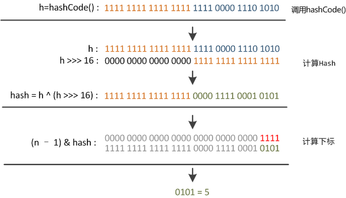

## hashmap

这段代码叫“**扰动函数**”。Java 8中这步已经简化了，只做一次16位右位移异或混合，而不是四次，但原理是不变的。下面以Java 8的源码为例解释，

```java
//Java 8中的散列值优化函数
static final int hash(Object key) {
int h;
return (key == null) ? 0 : (h = key.hashCode()) ^ (h >>> 16); //key.hashCode()为哈希算法，返回初始哈希值
}
```

```java
//Java 7中散列值优化函数
/**
 * Applies a supplemental hash function to a given hashCode, which
 * defends against poor quality hash functions.  This is critical
 * because HashMap uses power-of-two length hash tables, that
 * otherwise encounter collisions for hashCodes that do not differ
 * in lower bits. Note: Null keys always map to hash 0, thus index 0.
 */
static int hash(int h) {
    // This function ensures that hashCodes that differ only by
    // constant multiples at each bit position have a bounded
    // number of collisions (approximately 8 at default load factor).

    h ^= (h >>> 20) ^ (h >>> 12);
    return h ^ (h >>> 7) ^ (h >>> 4);
}
```

大家都知道上面代码里的`key.hashCode()`函数调用的是key键值类型自带的哈希函数，返回int型散列值。

理论上散列值是一个int型，如果直接拿散列值作为下标访问HashMap主数组的话，考虑到2进制32位带符号的int表值范围从**-2147483648**到**2147483648**。前后加起来大概40亿的映射空间。只要哈希函数映射得比较均匀松散，一般应用是很难出现碰撞的。

但问题是一个40亿长度的数组，内存是放不下的。你想，HashMap扩容之前的数组初始大小才16。所以这个散列值是不能直接拿来用的。用之前还要先做对数组的长度取模运算，得到的余数才能用来访问数组下标。源码中模运算是在这个`indexFor()`函数里完成的。

```java
bucketIndex = indexFor(hash, table.length);
```

`indexFor`的代码也很简单，就是把散列值和数组长度做一个"与"操作，

```java
static int indexFor(int h, int length) {
    return h & (length-1);
}
```

顺便说一下，这也正好解释了为什么HashMap的数组长度要取2的整次幂。因为这样（数组长度-1）正好相当于一个“**低位掩码**”。“与”操作的结果就是散列值的高位全部归零，只保留低位值，用来做数组下标访问。

以初始长度16为例，16-1=15。2进制表示是`00000000 00000000 00001111`。和某散列值做“与”操作如下，结果就是截取了最低的四位值。

```
     10100101 11000100 00100101
&    00000000 00000000 00001111
----------------------------------
     00000000 00000000 00000101 //高位全部归零，只保留末四位
```

但这时候问题就来了，这样就算我的散列值分布再松散，要是只取最后几位的话，碰撞也会很严重。更要命的是如果散列本身做得不好，分布上成等差数列的漏洞，恰好使最后几个低位呈现规律性重复，就无比头疼。

这时候“**扰动函数**”的价值就体现出来了，说到这里大家应该猜出来了。看下面这个图，



右位移16位，正好是32bit的一半，自己的高半区和低半区做异或，就是为了**混合原始哈希码的高位和低位，以此来加大低位的随机性**。而且混合后的低位掺杂了高位的部分特征，这样高位的信息也被变相保留下来。

最后我们来看一下Peter Lawley的一篇专栏文章《An introduction to optimising a hashing strategy》里的的一个实验：他随机选取了352个字符串，在他们散列值完全没有冲突的前提下，对它们做低位掩码，取数组下标。


结果显示，当HashMap数组长度为512的时候，也就是用掩码取低9位的时候，在没有扰动函数的情况下，发生了103次碰撞，接近30%。而在使用了扰动函数之后只有92次碰撞。碰撞减少了将近10%。看来扰动函数确实还是有功效的。

但明显Java 8觉得扰动做一次就够了，做4次的话，多了可能边际效用也不大，所谓为了效率考虑就改成一次了。


## mybatis

### resultMap&resultType

概述

MyBatis中在查询进行select映射的时候，返回类型可以用resultType，也可以用resultMap，resultType是直接表示返回类型的，而resultMap则是对外部ResultMap的引用，但是resultType跟resultMap不能同时存在。

在MyBatis进行查询映射时，其实查询出来的每一个属性都是放在一个对应的Map里面的，其中键是属性名，值则是其对应的值。

①当提供的返回类型属性是resultType时，MyBatis会将Map里面的键值对取出赋给resultType所指定的对象对应的属性。所以其实MyBatis的每一个查询映射的返回类型都是ResultMap，只是当提供的返回类型属性是resultType的时候，MyBatis对自动的给把对应的值赋给resultType所指定对象的属性。

②当提供的返回类型是resultMap时，因为Map不能很好表示领域模型，就需要自己再进一步的把它转化为对应的对象，这常常在复杂查询中很有作用。


## fail-fast

> fail-fast是一个通用的系统设计思想，是一种错误检测机制，一旦检测到可能发生错误，就立马抛出异常，程序不继续往下执行。

>如果在使用Iterator遍历过程中，不通过Iterator，而是通过***集合类自身的方法***对集合进行***添加/删除***操作。那么在Iterator进行下一次的遍历时，经检测发现有一次集合的修改操作并未通过自身进行，那么可能是发生了并发被其他线程执行的，这时候就会抛出异常，来提示用户可能发生了并发修改，这就是所谓的fail-fast机制。

### 异常例子

#### 增强for循环遍历过程中，使用*数组*的add/remove方法

```java
List<String> userNames = new ArrayList<String>() {{
    add("Hollis");
    add("hollis");
    add("HollisChuang");
    add("H");
}};

for (String userName : userNames) {
    if (userName.equals("Hollis")) {
        userNames.remove(userName);
    }
}

System.out.println(userNames);
```

会抛出异常

```java
Exception in thread "main" java.util.ConcurrentModificationException
at java.util.ArrayList$Itr.checkForComodification(ArrayList.java:909)
at java.util.ArrayList$Itr.next(ArrayList.java:859)
at com.hollis.ForEach.main(ForEach.java:22)
```

**原因分析**：

增强for循环其实是Java提供的一个语法糖，我们将代码反编译后可以看到增强for循环其实是用的是`Iterator`迭代器。

`remove`和`add`操作会导致`modCount`和迭代器中的`expectedModCount`不一致。

### 解决方案

#### **1、直接使用普通for循环进行操作**

我们说不能在foreach中进行，但是使用普通的for循环还是可以的，因为普通for循环并没有用到Iterator的遍历，所以压根就没有进行fail-fast的检验。

**存在问题**：

- remove操作会改变List中元素的下标，可能存在漏删的情况。
- 数组越界？

#### **2、直接使用Iterator进行操作**

除了直接使用普通for循环以外，我们还可以直接使用Iterator提供的remove方法。

```java
    List<String> userNames = new ArrayList<String>() {{
        add("Hollis");
        add("hollis");
        add("HollisChuang");
        add("H");
    }};

    Iterator iterator = userNames.iterator();

    while (iterator.hasNext()) {
        if (iterator.next().equals("Hollis")) {
            iterator.remove();
        }
    }
    System.out.println(userNames);
```

#### **3、使用Java 8中提供的filter过滤**

Java 8中可以把集合转换成流，对于流有一种filter操作， 可以对原始 Stream 进行某项测试，通过测试的元素被留下来生成一个新 Stream。

```java
    List<String> userNames = new ArrayList<String>() {{
        add("Hollis");
        add("hollis");
        add("HollisChuang");
        add("H");
    }};

    userNames = userNames.stream().filter(userName -> !userName.equals("Hollis")).collect(Collectors.toList());
    System.out.println(userNames);
```

## 栈和队列

### 常用方法

Java里有一个叫做Stack的类，却没有叫做Queue的类（它是个接口名字）。当需要使用栈时，Java已不推荐使用Stack，而是推荐使用更高效的ArrayDeque；既然Queue只是一个接口，当需要使用队列时也就首选`ArrayDeque`了（次选是`LinkedList`）。

#### 队列Queue

| Queue Method  | Equivalent Deque Method | 说明                                   |
| ------------- | ----------------------- | -------------------------------------- |
| ==add(e)==    | addLast(e)              | 向队尾插入元素，失败则`抛出异常`       |
| offer(e)      | offerLast(e)            | 向队尾插入元素，失败则返回`false`      |
| ==remove()==  | removeFirst()           | 获取并删除队首元素，失败则`抛出异常`   |
| poll()        | pollFirst()             | 获取并删除队首元素，失败则返回`null`   |
| ==element()== | getFirst()              | 获取但不删除队首元素，失败则`抛出异常` |
| peek()        | peekFirst()             | 获取但不删除队首元素，失败则返回`null` |

#### 栈Stack

| Stack Method | Equivalent Deque Method | 说明                                   |
| ------------ | ----------------------- | -------------------------------------- |
| ==push(e)==  | addFirst(e)             | 向栈顶插入元素，失败则`抛出异常`       |
| 无           | offerFirst(e)           | 向栈顶插入元素，失败则返回false        |
| ==pop()==    | removeFirst()           | 获取并删除栈顶元素，失败则`抛出异常`   |
| 无           | pollFirst()             | 获取并删除栈顶元素，失败则返回null     |
| ==peek()==   | getFirst()              | 获取但不删除栈顶元素，失败则`抛出异常` |
| 无           | peekFirst()             | 获取但不删除栈顶元素，失败则返回null   |

`ArrayDeque`和`LinkedList`是Deque的两个通用实现，由于官方更推荐使用AarryDeque用作栈和队列，
从名字可以看出ArrayDeque底层通过`数组`实现，为了满足可以同时在数组两端插入或删除元素的需求，该数组还必须是循环的，即`循环数组（circular array）`，也就是说数组的任何一点都可能被看作起点或者终点。ArrayDeque是`非线程安全`的（not thread-safe），当多个线程同时使用的时候，需要程序员手动同步；另外，该容器`不允许放入null`元素。


## Java8

- 语法相关新特性
  - 默认接口方法
    - 多个默认方法
    - 静态默认方法
  - Lambda 表达式
    - 变量作用域
  - 函数式接口
  - 方法引用
  - 支持重复注解并拓宽注解的应用场景
- 工具相关新特性
  - Stream API
  - Optional 类
  - 时间API
  - Nashorn JavaScript引擎
  - Base64
  - 并行数组
- 并发相关新特性
- Java命令行工具相关
  - Nashorn引擎：jjs
  - 类依赖分析器：jdeps
- 编译器相关特性
- JVM的新特性

[参考](https://www.cnblogs.com/54chensongxia/p/13858850.html)

### 默认接口方法

> 从 Java 8 开始，接口支持定义默认实现方法。所谓的默认方法，就是指接口中定义的抽象方法可以由接口本身提供默认实现，而不一定要实现类去实现这个抽象方法。

使用接口默认方法的最主要目的是：**修改接口后不需要大范围的修改以前老的实现类**

一个类实现了多个接口，且这些接口有相同的默认方法

```java
public interface Vehicle {
   default void print(){
      System.out.println("我是一辆车!");
   }
}
 
public interface FourWheeler {
   default void print(){
      System.out.println("我是一辆四轮车!");
   }
}
```

1. 第一个解决方案是创建自己的默认方法，来`覆盖重写`接口的默认方法：

```java
public class Car implements Vehicle, FourWheeler {
   default void print(){
      System.out.println("我是一辆四轮汽车!");
   }
}
```

2. 第二种解决方案可以使用 `super` 来调用指定接口的默认方法：

```java
public class Car implements Vehicle, FourWheeler {
   public void print(){
      Vehicle.super.print();
   }
}
```

### Lambda表达式

> Lambda 表达式，也可称为闭包，它是推动 Java 8 发布的最重要新特性。Lambda 允许把函数作为一个方法的参数（函数作为参数传递进方法中）。

使用 Lambda 表达式可以使代码变的更加简洁紧凑，其本质是一个Java语法糖

#### 语法糖

**语法糖（Syntactic Sugar）**，也称糖衣语法，指在计算机语言中添加的**某种语法**，这种语法对语言本身的功能来说没有什么影响，只是为了方便程序员进行开发，提高开发效率，使用这种语法写出来的程序可读性也更高。说白了，语法糖就是对现有语法的一个封装。

**但其实，Java虚拟机是并不支持语法糖的，语法糖在程序编译阶段就会被还原成简单的基础语法结构，这个过程就是解语法糖**。所以在Java中真正支持语法糖的是Java编译器。

- switch-case对String和枚举类的支持
- 泛型
- 包装类自动装箱与拆箱
- 方法变长参数
- 枚举
- 内部类
- 条件编译
- 断言
- 数值字面量
- 增强for循环
- try-with-resource语法
- Lambda表达式
- 字符串+号语法


## AQS


## CAS

Java并发框架的基石一共有两块，一块是本文介绍的CAS，另一块就是AQS

### 什么是CAS机制

CAS机制是一种数据更新的方式。在具体讲什么是CAS机制之前，我们先来聊下在多线程环境下，对共享变量进行数据更新的两种模式：悲观锁模式和乐观锁模式。

#### 悲观锁

**悲观锁**更新的方式认为：在更新数据的时候大概率会有其他线程去争夺共享资源，所以悲观锁的做法是：==第一个获取资源的线程会将资源锁定起来==，其他没争夺到资源的线程只能进入阻塞队列，等第一个获取资源的线程释放锁之后，这些线程才能有机会重新争夺资源。synchronized就是java中悲观锁的典型实现，synchronized使用起来非常简单方便，但是会使没争抢到资源的线程进入阻塞状态，线程在阻塞状态和Runnable状态之间切换效率较低（比较慢）。比如你的更新操作其实是非常快的，这种情况下你还用synchronized将其他线程都锁住了，线程从Blocked状态切换回Runnable华的时间可能比你的更新操作的时间还要长。

#### 乐观锁

**乐观锁**更新方式认为:在更新数据的时候其他线程争抢这个共享变量的概率非常小，所以更新数据的时候不会对共享数据加锁。但是在==正式更新数据之前会检查数据是否被其他线程改变过==，如果未被其他线程改变过就将共享变量更新成最新值，如果发现共享变量已经被其他线程更新过了，就重试，直到成功为止。CAS机制就是乐观锁的典型实现。

#### CAS

CAS，是Compare and Swap的简称，在这个机制中有三个核心的参数：

- 主内存中存放的共享变量的值：V（一般情况下这个V是内存的地址值，通过这个地址可以获得内存中的值）
- 工作内存中共享变量的副本值，也叫预期值：A
- 需要将共享变量更新到的最新值：B

[](https://img2018.cnblogs.com/blog/1775037/202001/1775037-20200106164315461-658325570.jpg)

如上图中，主存中保存V值，线程中要使用V值要先从主存中读取V值到线程的工作内存A中，然后计算后变成B值，最后再把B值写回到内存V值中。多个线程共用V值都是如此操作。==CAS的核心是在将B值写入到V之前要比较A值和V值是否相同==，如果不相同证明此时V值已经被其他线程改变，重新将V值赋给A，并重新计算得到B，如果相同，则将B值赋给V。

值得注意的是CAS机制中的这步步骤是==原子性==的（从指令层面提供的原子操作），所以CAS机制可以解决多线程并发编程对共享变量读写的原子性问题。

### CAS机制优缺点

#### 缺点

##### **1. ABA问题**

ABA问题：CAS在操作的时候会检查变量的值是否被更改过，如果没有则更新值，但是带来一个问题，最开始的值是A，接着变成B，最后又变成了A。经过检查这个值确实没有修改过，因为最后的值还是A，但是实际上这个值确实已经被修改过了。为了解决这个问题，在每次进行操作的时候加上一个==版本号==，每次操作的就是两个值，一个版本号和某个值，A——>B——>A问题就变成了1A——>2B——>3A。在jdk中提供了AtomicStampedReference类解决ABA问题，用Pair这个内部类实现，包含两个属性，分别代表版本号和引用，在compareAndSet中先对当前引用进行检查，再对版本号标志进行检查，只有全部相等才更新值。

##### **2. 可能会消耗较高的CPU**

看起来CAS比锁的效率高，从阻塞机制变成了非阻塞机制，减少了线程之间等待的时间。每个方法不能绝对的比另一个好，在线程之间竞争程度大的时候，如果使用CAS，每次都有很多的线程在竞争，也就是说CAS机制不能更新成功。这种情况下CAS机制会一直重试，这样就会比较耗费CPU。**因此可以看出，如果线程之间竞争程度小，使用CAS是一个很好的选择；但是如果竞争很大，使用锁可能是个更好的选择**。在并发量非常高的环境中，如果仍然想通过原子类来更新的话，可以使用AtomicLong的替代类：LongAdder。

##### **3. 不能保证代码块的原子性**

Java中的CAS机制只能保证共享变量操作的原子性，而不能保证代码块的原子性（这是时候就需要synchronied锁了，你会发现synchronied真的是万能的）。

#### 优点

- 可以保证变量操作的原子性；
- 并发量不是很高的情况下，使用CAS机制比使用锁机制效率更高；
- 在线程对共享资源占用时间较短的情况下，使用CAS机制效率也会较高。


## volatile

> 一旦一个共享变量（类的成员变量、类的静态成员变量）被volatile修饰之后，那么就具备了两层语义：

　　1）保证了不同线程对这个变量进行操作时的可见性，即一个线程修改了某个变量的值，这新值对其他线程来说是立即可见的。

　　2）禁止进行指令重排序。

### 原理和实现机制

> “观察加入volatile关键字和没有加入volatile关键字时所生成的汇编代码发现，加入volatile关键字时，会多出一个lock前缀指令”

　　lock前缀指令实际上相当于一个**内存屏障**（也成内存栅栏），内存屏障会提供3个功能：

　　1）它确保指令重排序时不会把其后面的指令排到内存屏障之前的位置，也不会把前面的指令排到内存屏障的后面；即在执行到内存屏障这句指令时，在它前面的操作已经全部完成；

　　2）它会强制将对缓存的修改操作立即写入主存；

　　3）如果是写操作，它会导致其他CPU中对应的缓存行无效。


### 原子性

> 在Java中，对基本数据类型的变量的读取和赋值操作是原子性操作，即这些操作是不可被中断的，要么执行，要么不执行。

请分析以下哪些操作是原子性操作：

```
x = 10;         //语句1 √
y = x;         //语句2  ×
x++;           //语句3  ×
x = x + 1;     //语句4  ×
```

　　语句1是直接将数值10赋值给x，也就是说线程执行这个语句的会直接将数值10写入到工作内存中。

　　语句2实际上包含2个操作，它先要去读取x的值，再将x的值写入工作内存，虽然读取x的值以及 将x的值写入工作内存 这2个操作都是原子性操作，但是合起来就不是原子性操作了。

　　同样的，x++和 x = x+1包括3个操作：读取x的值，进行加1操作，写入新的值。

 　所以上面4个语句只有语句1的操作具备原子性。

　　也就是说，==只有简单的读取、赋值（而且必须是将数字赋值给某个变量，变量之间的相互赋值不是原子操作）才是原子操作==。

　　不过这里有一点需要注意：在32位平台下，对64位数据的读取和赋值是需要通过两个操作来完成的，不能保证其原子性。但是好像在最新的JDK中，JVM已经保证对64位数据的读取和赋值也是原子性操作了。

　　从上面可以看出，Java内存模型只保证了基本读取和赋值是原子性操作，如果要实现更大范围操作的原子性，可以通过synchronized和Lock来实现。由于synchronized和Lock能够保证任一时刻只有一个线程执行该代码块，那么自然就不存在原子性问题了，从而保证了原子性。

#### volatile不能保证原子性

```java
public class Test {
    public volatile int inc = 0;
     
    public void increase() {
        inc++;
    }
     
    public static void main(String[] args) {
        final Test test = new Test();
        for(int i=0;i<10;i++){
            new Thread(){
                public void run() {
                    for(int j=0;j<1000;j++)
                        test.increase();
                };
            }.start();
        }
         
        while(Thread.activeCount()>1)  //保证前面的线程都执行完
            Thread.yield();
        System.out.println(test.inc);
    }
}
```

自增操作是不具备原子性的，它包括读取变量的原始值、进行加1操作、写入工作内存。那么就是说自增操作的三个子操作可能会分割开执行，就有可能导致下面这种情况出现：

　　假如某个时刻变量inc的值为10，

　　线程1对变量进行自增操作，线程1先读取了变量inc的原始值，然后线程1被阻塞了；

　　然后线程2对变量进行自增操作，线程2也去读取变量inc的原始值，由于线程1只是对变量inc进行读取操作，而没有对变量进行修改操作，所以不会导致线程2的工作内存中缓存变量inc的缓存行无效，所以线程2会直接去主存读取inc的值，发现inc的值时10，然后进行加1操作，并把11写入工作内存，最后写入主存。

　　然后线程1接着进行加1操作，由于已经读取了inc的值，注意此时在线程1的工作内存中inc的值仍然为10，所以线程1对inc进行加1操作后inc的值为11，然后将11写入工作内存，最后写入主存。

　　那么两个线程分别进行了一次自增操作后，inc只增加了1。

　　解释到这里，可能有朋友会有疑问，不对啊，前面不是保证一个变量在修改volatile变量时，会让缓存行无效吗？然后其他线程去读就会读到新的值，对，这个没错。这个就是上面的happens-before规则中的volatile变量规则，但是要注意，线程1对变量进行读取操作之后，被阻塞了的话，并没有对inc值进行修改。然后虽然volatile能保证线程2对变量inc的值读取是从内存中读取的，但是线程1没有进行修改，所以线程2根本就不会看到修改的值。

　　根源就在这里，自增操作不是原子性操作，而且volatile也无法保证对变量的任何操作都是原子性的。

##### 解决方案

1. 采用synchronized：

```java
public class Test {
    public  int inc = 0;
    
    public synchronized void increase() {
        inc++;
    }
    
    public static void main(String[] args) {
        final Test test = new Test();
        for(int i=0;i<10;i++){
            new Thread(){
                public void run() {
                    for(int j=0;j<1000;j++)
                        test.increase();
                };
            }.start();
        }
        
        while(Thread.activeCount()>1)  //保证前面的线程都执行完
            Thread.yield();
        System.out.println(test.inc);
    }
}
```

2. 使用Lock

```java
public class Test {
    public  int inc = 0;
    Lock lock = new ReentrantLock();
    
    public  void increase() {
        lock.lock();
        try {
            inc++;
        } finally{
            lock.unlock();
        }
    }
    
    public static void main(String[] args) {
        final Test test = new Test();
        for(int i=0;i<10;i++){
            new Thread(){
                public void run() {
                    for(int j=0;j<1000;j++)
                        test.increase();
                };
            }.start();
        }
        
        while(Thread.activeCount()>1)  //保证前面的线程都执行完
            Thread.yield();
        System.out.println(test.inc);
    }
}
```

3. 使用AtomicInteger

```java
public class Test {
    public  AtomicInteger inc = new AtomicInteger();
     
    public  void increase() {
        inc.getAndIncrement();
    }
    
    public static void main(String[] args) {
        final Test test = new Test();
        for(int i=0;i<10;i++){
            new Thread(){
                public void run() {
                    for(int j=0;j<1000;j++)
                        test.increase();
                };
            }.start();
        }
        
        while(Thread.activeCount()>1)  //保证前面的线程都执行完
            Thread.yield();
        System.out.println(test.inc);
    }
}
```

在java 1.5的java.util.concurrent.atomic包下提供了一些原子操作类，即对基本数据类型的 自增（加1操作），自减（减1操作）、以及加法操作（加一个数），减法操作（减一个数）进行了封装，保证这些操作是原子性操作。atomic是利用CAS来实现原子性操作的（Compare And Swap），CAS实际上是利用处理器提供的CMPXCHG指令实现的，而处理器执行CMPXCHG指令是一个原子性操作。


## 内部类

> 在 Java 中，可以将一个类定义在另一个类里面或者一个方法里面，这样的类称为内部类。广泛意义上的内部类一般来说包括这四种：**成员内部类**、**局部内部类**、**匿名内部类**和**静态内部类**。

- 成员内部类可以无条件访问外部类的所有成员属性和成员方法（包括private成员和静态成员）
- 外部类中如果要访问成员内部类的成员，必须先创建一个成员内部类的对象，再通过指向这个对象的引用来访问

### 外部类访问内部类

对于成员内部类，必须先产生外部类的实例化对象，才能产生内部类的实例化对象。而静态内部类不用产生外部类的实例化对象即可产生内部类的实例化对象。

创建静态内部类对象的一般形式为： **外部类类名.内部类类名 xxx = new 外部类类名.内部类类名()**

创建成员内部类对象的一般形式为： **外部类类名.内部类类名 xxx = 外部类对象名.new 内部类类名()**

**eg**

```java
public class Test{
    public static void main(String[] args){
           // 初始化Bean1
           (1)
        	Test test = new Test();
        	Test.Bean1 bean1 = test.new Bean1();
           bean1.I++;
           // 初始化Bean2
           (2)
        	Test.Bean2 b2 = new Test.Bean2();
           bean2.J++;
           //初始化Bean3
           (3)
			Bean bean = new Bean();     
			Bean.Bean3 bean3 =  bean.new Bean3();
           bean3.k++;
    }
    class Bean1{
           public int I = 0;
    }
 
    static class Bean2{
           public int J = 0;
    }
}
 
class Bean{
    class Bean3{
           public int k = 0;
    }
}
```

