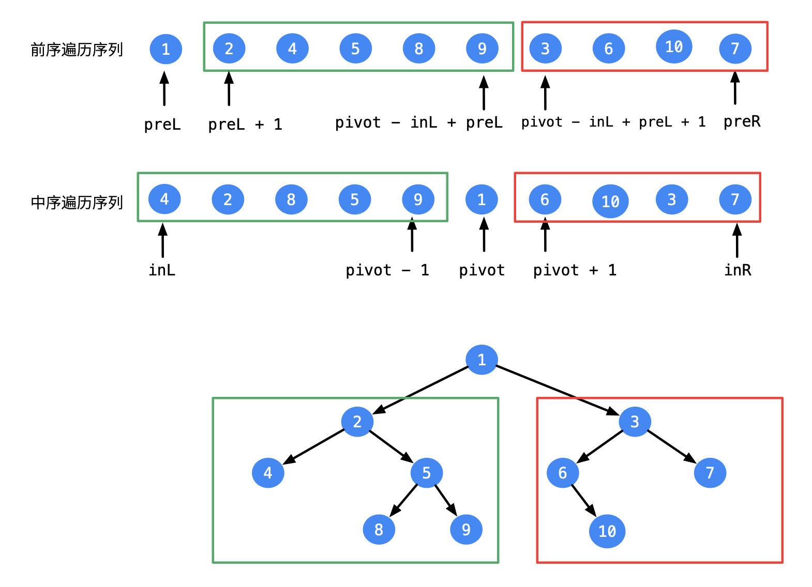
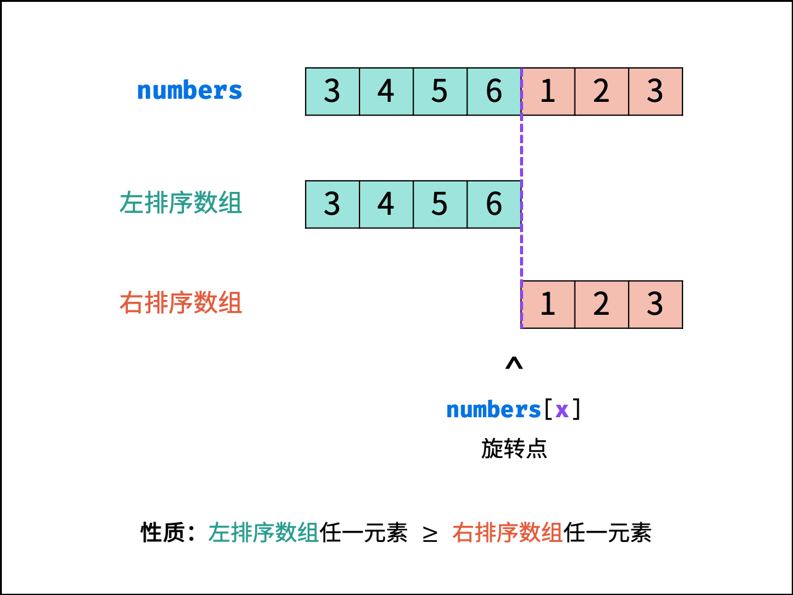
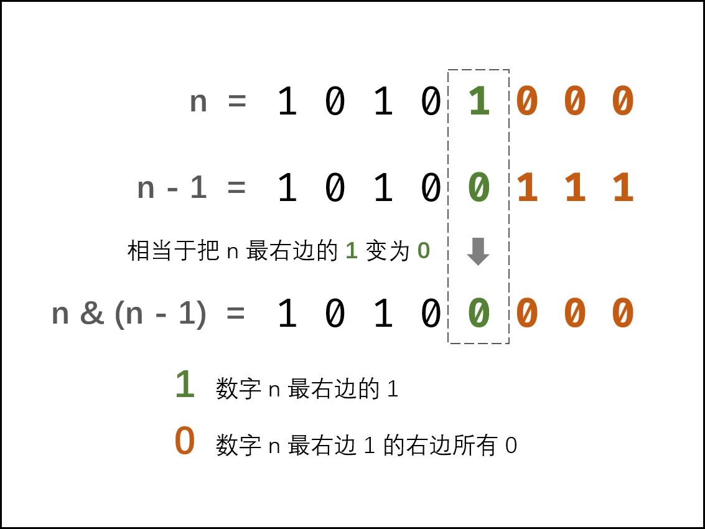
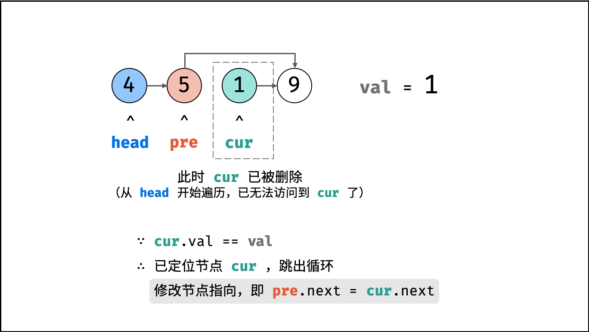
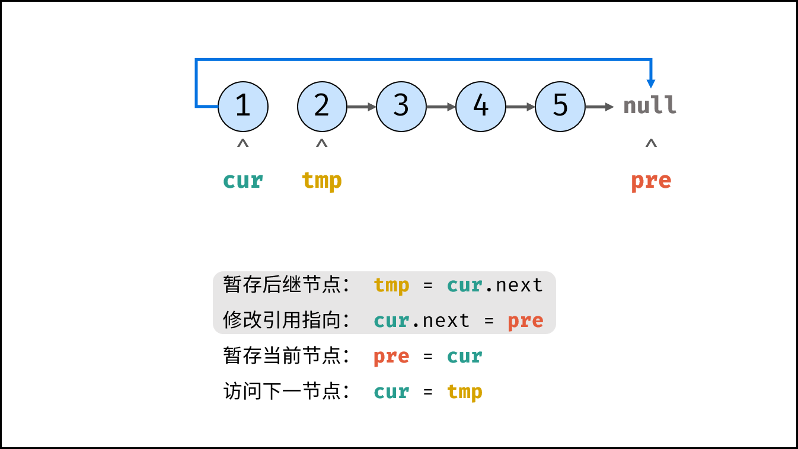
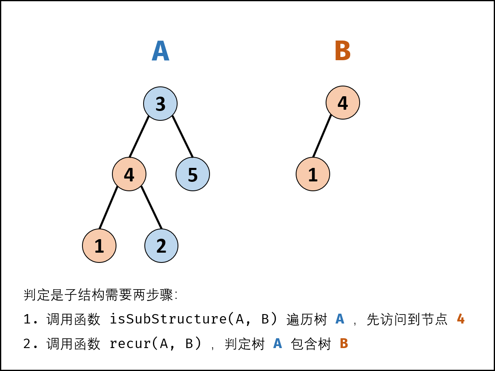
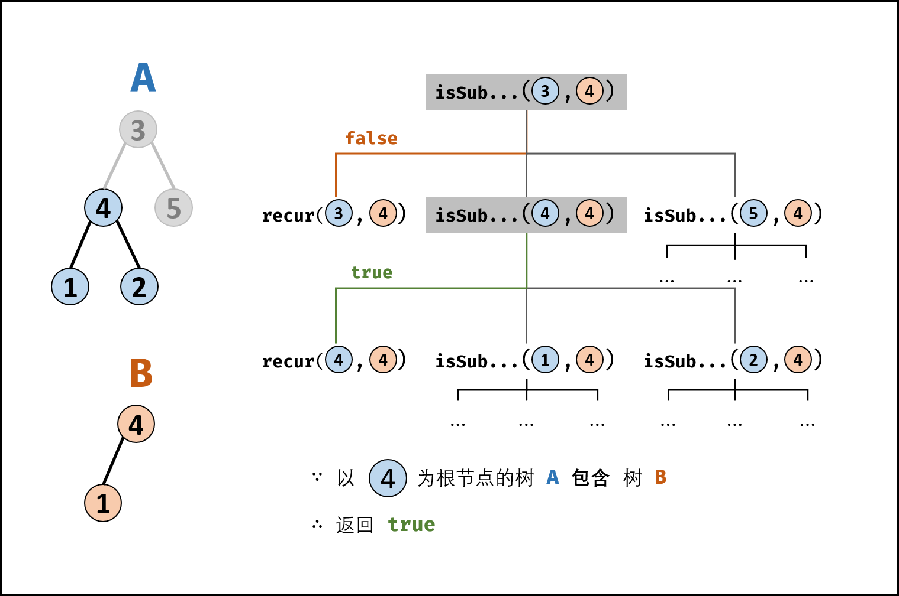
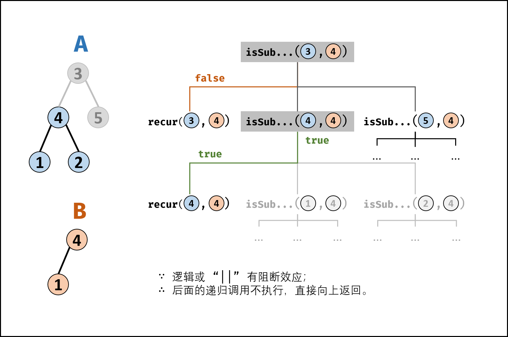
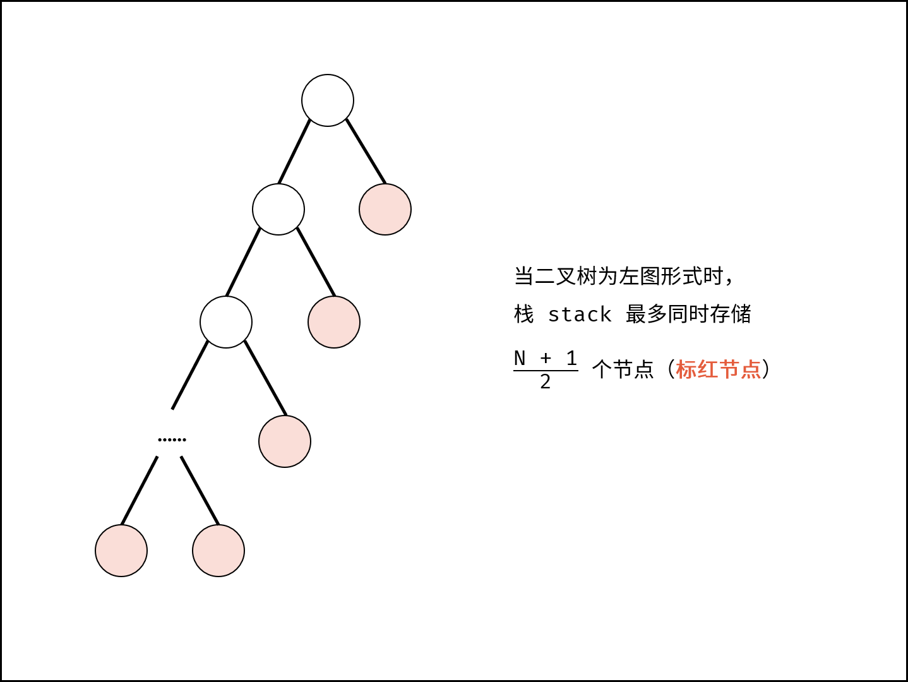

****

## 03. 数组中重复的数字

### 题目描述

找出数组中重复的数字。

> 在一个长度为 n 的数组 nums 里的所有数字都在 0～n-1 的范围内。数组中某些数字是重复的，但不知道有几个数字重复了，也不知道每个数字重复了几次。请找出数组中任意一个重复的数字。

**示例 1：**

```
输入：
[2, 3, 1, 0, 2, 5, 3]
输出：2 或 3 
```

**限制：**

```
2 <= n <= 100000
```

### 解题思路

#### 一、 原地置换

> 思路分析

 		如果没有重复数字，那么正常排序后，数字i应该在下标为i的位置，所以思路是重头扫描数组，遇到下标为i的数字如果不是i的话，（假设为m),那么我们就拿与下标m的数字交换。在交换过程中，如果有重复的数字发生，那么终止返回ture

1、题目明确说明了数组长度为n，范围为 n-1，也就是若无重复元素排序后下标0123对应的数字就应该是0123；

2、对数组排序，其实也就是让萝卜归位，1号坑要放1号萝卜，2号坑要放2号萝卜......排序过程中查找有无重复元素。先考虑没有重复元素的情况：

```yaml
 nums[i]     3  1  0  2   萝卜   
     i       0  1  2  3   坑  
```

0号坑说我要的是0号萝卜，不要3号萝卜，所以会去和3号坑的萝卜交换，因为如果0号坑拿了3号坑的3号萝卜，那说明3号坑装的也肯定是别人家的萝卜，所以要跟3号坑换，换完是这样的：

```yaml
 nums[i]     2  1  0  3   萝卜  
     i       0  1  2  3   坑 
```

然而0号坑还没找到自己的萝卜，它不要2号萝卜，又去和2号坑的萝卜交换，换完是这样的：

```yaml
 nums[i]     0  1  2  3   萝卜 
     i       0  1  2  3   坑  
```

这时候刚好就是一一对应的，交换过程也不会出现不同坑有相同编号的萝卜。要注意交换用的是while，也就是0号坑只有拿到0号萝卜，1号坑才能开始找自己的萝卜。

3、如果有重复元素，例如：

```yaml
 nums[i]     1  2  3  2    萝卜
     i       0  1  2  3    坑
```

同样的，0号坑不要1号，先和1号坑交换，交换完这样的：

```yaml
 nums[i]     2  1  3  2    萝卜
     i       0  1  2  3    坑
```

0号坑不要2号萝卜，去和2号坑交换，交换完这样的：

```yaml
 nums[i]     3  1  2  2    萝卜
     i       0  1  2  3    坑
```

0号坑不要3号萝卜，去和3号坑交换，交换完这样的：

```yaml
 nums[i]     2  1  2  3    萝卜
     i       0  1  2  3    坑
```

0号坑不要2号萝卜，去和2号坑交换，结果发现你2号坑也是2号萝卜，那我还换个锤子，同时也说明有重复元素出现。

4、总结

其实这种原地交换就是为了降低空间复杂度，只需多要1个坑来周转交换的萝卜就好了，空间复杂度O（1）。

> 复杂度分析

- 时间复杂度 O(N) ： 遍历数组使用 O(N)，每轮遍历的判断和交换操作使用 O(1) 。
- 空间复杂度 O(1) ： 使用常数复杂度的额外空间。

> 代码实现

```java
class Solution {
    // 数组长度为n，范围为n-1，若无重复元素排序后下标0123对应的数字也应该是0123
    public int findRepeatNumber(int[] nums) {
        int temp;
        // 从头扫描数组
        for(int i=0;i<nums.length;i++){
            // 如果下标i的数字不是i，说明位置不对，需要交换
            while(nums[i]!=i){
                // 如果下标i的数字与要交换的位置的数字一样，说明有重复元素，直接返回
                if(nums[i]==nums[nums[i]]){
                    return nums[i];
                }
                // 交换，nums[i]号萝卜归位
                temp=nums[i];
                nums[i]=nums[temp];
                nums[temp]=temp;
            }
        }
        return -1;
    }
}
```

#### 二.、哈希表Set

> 思路分析

利用数据结构特点，容易想到使用哈希表（Set）记录数组的各个数字，当查找到重复数字则直接返回。

算法流程：
初始化： 新建 HashSet ，记为 dic ；
遍历数组 nums中的每个数字 num ：
当 num 在 dic 中，说明重复，直接返回 num ；
将 num 添加至 dic 中；
返回 -1 。本题中一定有重复数字，因此这里返回多少都可以。

> 复杂度分析

- 时间复杂度 O(N)： 遍历数组使用 O(N)，HashSet 添加与查找元素皆为 O(1) 。
- 空间复杂度 O(N)： HashSet 占用 O(N)大小的额外空间。

> 代码实现

Java版本

```java
class Solution {
    public int findRepeatNumber(int[] nums) {
        Set<Integer> dic=new HashSet<>();
        for(int num:nums){
            if(dic.contains(num)){
                return num;
            }
            dic.add(num);
        }
        return -1;
    }
}
```

Python版本

```python
class Solution:
    def findRepeatNumber(self, nums: [int]) -> int:
        dic = set()
        for num in nums:
            if num in dic: return num
            dic.add(num)
        return -1
```


## 04. 二维数组中的查找

### 题目描述

> 在一个 n * m 的二维数组中，每一行都按照从左到右递增的顺序排序，每一列都按照从上到下递增的顺序排序。请完成一个高效的函数，输入这样的一个二维数组和一个整数，判断数组中是否含有该整数。

**示例:**

现有矩阵 matrix 如下：
```
[
  [1,   4,  7, 11, 15],
  [2,   5,  8, 12, 19],
  [3,   6,  9, 16, 22],
  [10, 13, 14, 17, 24],
  [18, 21, 23, 26, 30]
]
```
给定 target = 5，返回 true。

给定 target = 20，返回 false。

**限制：**

- 0 <= n <= 1000
- 0 <= m <= 1000

### 解题思路

#### 一、暴力

> 分析

如果不考虑二维数组排好序的特点，则直接遍历整个二维数组的每一个元素，判断目标值是否在二维数组中存在。

依次遍历二维数组的每一行和每一列。如果找到一个元素等于目标值，则返回 true。如果遍历完毕仍未找到等于目标值的元素，则返回 false。

> 代码

```Java
class Solution {
    public boolean findNumberIn2DArray(int[][] matrix, int target) {
        if (matrix == null || matrix.length == 0 || matrix[0].length == 0) {
            return false;
        }
        int rows = matrix.length, columns = matrix[0].length;
        for (int i = 0; i < rows; i++) {
            for (int j = 0; j < columns; j++) {
                if (matrix[i][j] == target) {
                    return true;
                }
            }
        }
        return false;
    }
}
```

> 复杂度分析

- 时间复杂度：O(nm)。二维数组中的每个元素都被遍历，因此时间复杂度为二维数组的大小。
- 空间复杂度：O(1)。

#### 二、线性查找

> 分析

由于给定的二维数组具备每行从左到右递增以及每列从上到下递增的特点，当访问到一个元素时，可以排除数组中的部分元素。

从二维数组的右上角开始查找。如果当前元素等于目标值，则返回` true`。如果当前元素大于目标值，则移到左边一列。如果当前元素小于目标值，则移到下边一行。

可以证明这种方法不会错过目标值。如果当前元素大于目标值，说明当前元素的下边的所有元素都一定大于目标值，因此往下查找不可能找到目标值，往左查找可能找到目标值。如果当前元素小于目标值，说明当前元素的左边的所有元素都一定小于目标值，因此往左查找不可能找到目标值，往下查找可能找到目标值。

- 若数组为空，返回` false`
- 初始化行下标为 0，列下标为二维数组的列数减 1
- 重复下列步骤，直到行下标或列下标超出边界
  - 获得当前下标位置的元素` num`
  - 如果 `num` 和 `target` 相等，返回 `true`
  - 如果 `num` 大于 `target`，列下标减 1
  - 如果 `num` 小于 `target`，行下标加 1
- 循环体执行完毕仍未找到元素等于 `target` ，说明不存在这样的元素，返回 `false`

> 代码

```Java
class Solution {
    public boolean findNumberIn2DArray(int[][] matrix, int target) {
        // 若数组为null或者空，直接返回false
        if(matrix==null||matrix.length==0||matrix[0].length==0){
            return false;
        }
        int rows=matrix.length,columns=matrix[0].length;
        // 初始化行下标为0，列下标为二维数组的列数减1，即右上角元素
        int row=0;
        int column=columns-1;
        // 不超出边界的情况下
        while(row<rows&&column>=0){
            int num=matrix[row][column];
            if(num==target){// 当前下标元素和target相等
                return true;
            }else if(num>target){// 当前下标元素大于target，列左移
                column--;
            }else{ // 当前下标元素小于target，行下移
                row++;
            }
        }
        return false;
    }
}
```

> 复杂度分析

- 时间复杂度：O(n+m)。访问到的下标的行最多增加 n 次，列最多减少 m 次，因此循环体最多执行 n + m 次。

- 空间复杂度：O(1)。


#### 三、二叉搜索树

> 分析

如下图所示，我们将矩阵逆时针旋转 45° ，并将其转化为图形式，发现其类似于 二叉搜索树 ，即对于每个元素，其左分支元素更小、右分支元素更大。因此，通过从 “根节点” 开始搜索，遇到比 `target` 大的元素就向左，反之向右，即可找到目标值 `target` 。


“根节点” 对应的是矩阵的 “左下角” 和 “右上角” 元素，本文称之为 标志数 ，以` matrix` 中的 左下角元素 为标志数 `flag` ，则有:

1. 若 `flag` > `target` ，则 `target` 一定在 `flag` 所在 行的上方 ，即 `flag` 所在行可被消去。
2. 若 `flag` < `target` ，则 `target` 一定在 `flag` 所在 列的右方 ，即 `flag` 所在列可被消去。

**算法流程：**

1. 从矩阵 matrix 左下角元素（索引设为 (i, j) ）开始遍历，并与目标值对比：
   - 当 `matrix[i][j] > target` 时，执行 i-- ，即消去第 i 行元素；
   - 当 `matrix[i][j] < target` 时，执行 j++ ，即消去第 j 列元素；
   - 当 `matrix[i][j] = target` 时，返回 truetrue ，代表找到目标值。

2. 若行索引或列索引越界，则代表矩阵中无目标值，返回 falsefalse 。
   每轮 i 或 j 移动后，相当于生成了“消去一行（列）的新矩阵”， 索引(i,j) 指向新矩阵的左下角元素（标志数），因此可重复使用以上性质消去行（列）。

> 复杂度分析：

- 时间复杂度 O(M+N)O(M+N) ：其中，NN 和 MM 分别为矩阵行数和列数，此算法最多循环 M+NM+N 次。
- 空间复杂度 O(1)O(1) : i, j 指针使用常数大小额外空间。

> 代码：

**Python**

```python
class Solution:
    def findNumberIn2DArray(self, matrix: List[List[int]], target: int) -> bool:
        i, j = len(matrix) - 1, 0
        while i >= 0 and j < len(matrix[0]):
            if matrix[i][j] > target: i -= 1
            elif matrix[i][j] < target: j += 1
            else: return True
        return False
```

**Java**

```java
class Solution {
    public boolean findNumberIn2DArray(int[][] matrix, int target) {
        int i = matrix.length - 1, j = 0;
        while(i >= 0 && j < matrix[0].length)
        {
            if(matrix[i][j] > target) i--;
            else if(matrix[i][j] < target) j++;
            else return true;
        }
        return false;
    }
}
```

C++

```c++
class Solution {
public:
    bool findNumberIn2DArray(vector<vector<int>>& matrix, int target) {
        int i = matrix.size() - 1, j = 0;
        while(i >= 0 && j < matrix[0].size())
        {
            if(matrix[i][j] > target) i--;
            else if(matrix[i][j] < target) j++;
            else return true;
        }
        return false;
    }
};
```

## 05. 替换空格

### 题目描述

> 请实现一个函数，把字符串 s 中的每个空格替换成"%20"。

**示例 1：**

```
输入：s = "We are happy."
输出："We%20are%20happy."
```

**限制：**

0 <= s 的长度 <= 10000

### 解题思路

#### 一、直接调用Java String Api

```java
class Solution {
    public String replaceSpace(String s) {
        // 直接调用API
        return s.replace(" ","%20");
}
```

#### 二、遍历添加

> 分析

在 Python 和 Java 等语言中，字符串都被设计成「不可变」的类型，即无法直接修改字符串的某一位字符，需要新建一个字符串实现。

> 算法流程：

1. 初始化一个 list (Python) / StringBuilder (Java) ，记为 res ；
2. 遍历列表 s 中的每个字符 c ：
   - 当 c 为空格时：向 res 后添加字符串 "%20" ；
   - 当 c 不为空格时：向 res 后添加字符 c ；
3. 将列表 res 转化为字符串并返回。

> 复杂度分析：

时间复杂度 O(N) ： 遍历使用 O(N) ，每轮添加（修改）字符操作使用 O(1) ；
空间复杂度 O(N) ： Python 新建的 list 和 Java 新建的 StringBuilder 都使用了线性大小的额外空间。


##### 1，使用临时数组

申请一个临时数组，然后再遍历这个字符串的每个字符，如果不是空格就把遍历的字符添加到临时数组中，如果是空格就添加3个字符'%'，'2'，'0'分别到临时数组中，最后再把临时数组转化为字符串即可。

```java
class Solution {
    public String replaceSpace(String s) {
        //利用临时数组
        int length=s.length();
        char[] array=new char[length*3];
        int index=0;
        for(int i=0;i<length;i++){
            char c=s.charAt(i);
            if(c==' '){
                array[index++]='%';
                array[index++]='2';
                array[index++]='0';
            }else{
                array[index++]=c;
            }
        }
        String newStr=new String(array,0,index);
        return newStr;
    }
}
```

**python代码**

```python
class Solution:
    def replaceSpace(self, s: str) -> str:
        res = []
        for c in s:
            if c == ' ': res.append("%20")
            else: res.append(c)
        return "".join(res)
```


##### 2，使用StringBuilder

把字符串中的每个字符一个个添加到StringBuilder中，如果遇到空格就把他换成%20。

```java
class Solution {
    public String replaceSpace(String s) {
        StringBuilder sb=new StringBuilder();
        for (int i=0;i<s.length();i++){
            if(s.charAt(i)==' '){
                sb.append("%20");
            }else{
                sb.append(s.charAt(i));
            }
        }
        return sb.toString();
    }
}
```

#### 三、原地修改（只适用于C++）

在 C++ 语言中， string 被设计成「可变」的类型（参考资料），因此可以在不新建字符串的情况下实现原地修改。

由于需要将空格替换为 "%20" ，字符串的总字符数增加，因此需要扩展原字符串 s 的长度，

计算公式为：`新字符串长度 = 原字符串长度 + 2 * 空格个数` ，示例如下图所示。


> 算法流程：

1. 初始化：空格数量 `count` ，字符串 `s` 的长度 `len` ；
2. 统计空格数量：遍历 `s` ，遇空格则 `count++` ；
3. 修改 `s` 长度：添加完 "%20" 后的字符串长度应为 `len + 2 * count` ；
4. 倒序遍历修改：`i` 指向原字符串尾部元素， `j `指向新字符串尾部元素；当 `i = j `时跳出（代表左方已没有空格，无需继续遍历）；
   - 当 `s[i] `不为空格时：执行 `s[j] = s[i] `；
   - 当 `s[i] `为空格时：将字符串闭区间 `[j-2, j] `的元素修改为 "%20" ；由于修改了 3 个元素，因此需要 `j -= 2 `；
5. 返回值：已修改的字符串 s ；

> 复杂度分析：

时间复杂度 O(N) ： 遍历统计、遍历修改皆使用 O(N)时间。
空间复杂度 O(1) ： 由于是原地扩展 s 长度，因此使用 O(1)额外空间。

```C++
class Solution {
public:
    string replaceSpace(string s) {
        int count = 0, len = s.size();
        // 统计空格数量
        for (char c : s) {
            if (c == ' ') count++;
        }
        // 修改 s 长度
        s.resize(len + 2 * count);
        // 倒序遍历修改
        for(int i = len - 1, j = s.size() - 1; i < j; i--, j--) {
            if (s[i] != ' ')
                s[j] = s[i];
            else {
                s[j - 2] = '%';
                s[j - 1] = '2';
                s[j] = '0';
                j -= 2;
            }
        }
        return s;
    }
};


```

## 06. 从尾到头打印链表

### 题目描述

> 输入一个链表的头节点，从尾到头反过来返回每个节点的值（用数组返回）。

 **示例 1：**

输入：head = [1,3,2]
输出：[2,3,1]

**限制：**

0 <= 链表长度 <= 10000

### 解题思路

#### 一、借助栈

栈的特点是后进先出，即最后压入栈的元素最先弹出。考虑到栈的这一特点，使用栈将链表元素顺序倒置。从链表的头节点开始，依次将每个节点压入栈内，然后依次弹出栈内的元素并存储到数组中。

> 算法描述

1. 创建一个栈，用于存储链表的节点
2. 创建一个指针，初始时指向链表的头节点
3. 当指针指向的元素非空时，重复下列操作：
   - 将指针指向的节点压入栈内
   - 将指针移到当前节点的下一个节点
4. 获得栈的大小 size，创建一个数组 print，其大小为 size
5. 创建下标并初始化 index = 0，重复 size 次下列操作：
   - 从栈内弹出一个节点，将该节点的值存到 print[index]
   - 将 index 的值加 1
6. 返回 print

> 复杂性分析

时间复杂度：O(n)。正向遍历一遍链表，然后从栈弹出全部节点，等于又反向遍历一遍链表。
空间复杂度：O(n)。额外使用一个栈存储链表中的每个节点。

> 代码实现

```java
/**
 * Definition for singly-linked list.
 * public class ListNode {
 *     int val;
 *     ListNode next;
 *     ListNode(int x) { val = x; }
 * }
 */
class Solution {
    public int[] reversePrint(ListNode head) {
        Stack<ListNode> stack = new Stack<ListNode>();
        ListNode temp = head;
        while (temp != null) {
            stack.push(temp);
            temp = temp.next;
        }
        int size = stack.size();
        int[] print = new int[size];
        for (int i = 0; i < size; i++) {
            print[i] = stack.pop().val;
        }
        return print;

        // 栈里存储Integer
        /**
        Stack<Integer> stack=new Stack<>();
        while(head!=null){
            stack.push(head.val);
            head=head.next;
        }
        int size=stack.size();
        int[] print=new int[size];
        for(int i=0;i<size;i++){
            print[i]=stack.pop();
        }
        return print;
        **/
    }
}
```

#### 二、递归

> 利用递归： 先走至链表末端，回溯时依次将节点值加入列表 ，这样就可以实现链表值的倒序输出。

**Python 算法流程：**

1. 递推阶段： 每次传入 `head.next `，以` head == None`（即走过链表尾部节点）为递归终止条件，此时返回空列表 [] 。
2. 回溯阶段： 利用 Python 语言特性，递归回溯时每次返回 `当前 list + 当前节点值 [head.val]` ，即可实现节点的倒序输出。

**Java 算法流程：**

1. 递推阶段： 每次传入 `head.next `，以 `head == null`（即走过链表尾部节点）为递归终止条件，此时直接返回。
2. 回溯阶段： 层层回溯时，将当前节点值加入列表，即tmp.add(head.val)。
3. 最终，将列表 tmp 转化为数组 res ，并返回即可。

> 复杂度分析：

时间复杂度 O(N)： 遍历链表，递归 N 次。
空间复杂度 O(N)： 系统递归需要使用 O(N) 的栈空间。

> 代码实现

**Java**

```java
class Solution {
    ArrayList<Integer> tmp = new ArrayList<Integer>();
    public int[] reversePrint(ListNode head) {
        recur(head);
        int[] res = new int[tmp.size()];
        for(int i = 0; i < res.length; i++)
            res[i] = tmp.get(i);
        return res;
    }
    void recur(ListNode head) {
        if(head == null) return;
        recur(head.next);
        tmp.add(head.val);
    }
}
```

**Python**

```python
class Solution:
    def reversePrint(self, head: ListNode) -> List[int]:
        return self.reversePrint(head.next) + [head.val] if head else []
```


## 07. 重建二叉树

### 题目描述

> 输入某二叉树的前序遍历和中序遍历的结果，请重建该二叉树。假设输入的前序遍历和中序遍历的结果中都不含重复的数字。

**示例**

```
前序遍历 preorder = [3,9,20,15,7]
中序遍历 inorder = [9,3,15,20,7]
```

返回如下的二叉树：

        3
       / \
      9  20
        /  \
       15   7
**限制：**

0 <= 节点个数 <= 5000


### 解题思路

#### 分治递归

##### 思路分析

前序遍历性质： 节点按照 `[ 根节点 | 左子树 | 右子树 ]` 排序。
中序遍历性质： 节点按照 `[ 左子树 | 根节点 | 右子树 ]` 排序。

**以题目示例为例：**

- 前序遍历划分 [ 3 | 9 | 20 15 7 ]
- 中序遍历划分 [ 9 | 3 | 15 20 7 ]

根据以上性质，可得出以下推论：

1. 前序遍历的首元素 为 树的根节点 node 的值。
2. 在中序遍历中搜索根节点 node 的索引 ，可将 中序遍历 划分为 [ 左子树 | 根节点 | 右子树 ] 。
3. 根据中序遍历中的左 / 右子树的节点数量，可将 前序遍历 划分为 [ 根节点 | 左子树 | 右子树 ] 。


通过以上三步，可确定 三个节点 ：

1. 树的根节点

2. 左子树根节点

3. 右子树根节点。

   对于树的左、右子树，仍可使用以上步骤划分子树的左右子树。

以上子树的递推性质是 **分治算法** 的体现，考虑通过递归对所有子树进行划分。

**分治算法解析：**

- 递推参数： 根节点在前序遍历的索引 `root `、子树在中序遍历的左边界` left` 、子树在中序遍历的右边界 `right `；
- 终止条件： 当 `left > right` ，代表已经越过叶节点，此时返回` null` ；
- 递推工作：
  1. 建立根节点` node` ： 节点值为` preorder[root]` ；
  
  2. 划分左右子树： 查找根节点在中序遍历` inorder `中的索引` i `；
     
     > 为了提升效率，本文使用哈希表 dic 存储中序遍历的值与索引的映射，查找操作的时间复杂度为 O(1)
     
  3. 计算构建左右子树： 开启左右子树递归；
     
     |        | 根节点索引（前序遍历） | 中序遍历左边界 | 中序遍历右边界 |
     | ------ | ---------------------- | -------------- | -------------- |
     | 左子树 | root + 1               | left           | i-1            |
     | 右子树 | i - left + root + 1    | i+1            | right          |
     
     > `i - left + root + 1`含义为 **根节点索引 + 左子树长度 + 1**

- 返回值： 回溯返回 `node` ，作为上一层递归中根节点的左 / 右子节点；


##### 复杂度分析

时间复杂度 O(N) ： 其中 N为树的节点数量。初始化 HashMap 需遍历 inorder ，占用 O(N) 。递归共建立 N 个节点，每层递归中的节点建立、搜索操作占用O(1) ，因此使用O(N) 时间。
空间复杂度 O(N) ： HashMap 使用 O(N) 额外空间。最差情况下，树退化为链表，递归深度达到 N ，占用 O(N) 额外空间；最好情况下，树为满二叉树，递归深度为 logN ，占用 O(logN) 额外空间。

##### 代码实现

```java
package com.example.learn.code;

import org.junit.Test;

import java.util.HashMap;
import java.util.Map;

/**
 * @author qzkuan(qqaxxn @ 163.com)
 * @className BuildTree
 * @packageName com.example.learn.code
 * @date 2021-03-18 16:51
 * @description TODO
 */
public class BuildTree {

    @Test
    public void test1() {
        Solution solution = new Solution();
        solution.buildTree(new int[]{3, 9, 20, 15, 7}, new int[]{9, 3, 15, 20, 7});
    }

    @Test
    public void test2() {
        Solution2 solution2 = new Solution2();
        solution2.buildTree(new int[]{3, 9, 20, 15, 7}, new int[]{9, 3, 15, 20, 7});
    }
}

/**
 * Definition for a binary tree node.
 */
class TreeNode {
    int val;
    TreeNode left;
    TreeNode right;

    TreeNode(int x) {
        val = x;
    }

    @Override
    public String toString() {
        return "TreeNode{" +
                "val=" + val +
                ", left=" + left +
                ", right=" + right +
                '}';
    }
}

/**
 * 分治递归
 */
class Solution {
    HashMap<Integer, Integer> map = new HashMap<>();//标记中序遍历
    int[] preorder;//保留的先序遍历，方便递归时依据索引查看先序遍历的值

    public TreeNode buildTree(int[] preorder, int[] inorder) {
        this.preorder = preorder;
        //将中序遍历的值及索引放在map中，方便递归时获取左子树与右子树的数量及其根的索引
        for (int i = 0; i < inorder.length; i++) {
            map.put(inorder[i], i);
        }
        //三个索引分别为
        //当前根的的索引
        //递归树的左边界，即数组左边界
        //递归树的右边界，即数组右边界
        return recursive(0, 0, inorder.length - 1);
    }

    /**
     * 递归创建左右子树
     *
     * @param pre_root 当前根的索引
     * @param in_left  递归树的左边界
     * @param in_right 递归树的右边界
     * @return
     */
    TreeNode recursive(int pre_root, int in_left, int in_right) {
        if (in_left > in_right) return null;// 相等的话就是自己
        TreeNode root = new TreeNode(preorder[pre_root]);//获取root节点
        int idx = map.get(preorder[pre_root]);//获取在中序遍历中根节点所在索引，以方便获取左子树的数量
        // 左子树的根的索引为【先序】中的根节点+1
        // 递归左子树的左边界为原来的【中序】in_left
        // 递归左子树的右边界为【中序】中的根节点索引-1
        root.left = recursive(pre_root + 1, in_left, idx - 1);
        // 右子树的根的索引为【先序】中的 当前根位置 + 左子树的数量 + 1
        // 递归右子树的左边界为【中序】中当前根节点+1
        // 递归右子树的有边界为【中序】中原来右子树的边界
        root.right = recursive(pre_root + (idx - in_left) + 1, idx + 1, in_right);
        System.out.println(root.toString());
        return root;

    }
}

/**
 * 分治递归二
 */
class Solution2 {

    // 使用全局变量是为了让递归方法少传一些参数，不一定非要这么做

    private Map<Integer, Integer> reverses;
    private int[] preorder;


    public TreeNode buildTree(int[] preorder, int[] inorder) {
        int preLen = preorder.length;
        int inLen = inorder.length;

        // 可以不做判断，因为题目中给出的数据都是有效的
        if (preLen != inLen) {
            return null;
        }

        this.preorder = preorder;

        // 以空间换时间，否则，找根结点在中序遍历中的位置需要遍历
        reverses = new HashMap<>(inLen);
        for (int i = 0; i < inLen; i++) {
            reverses.put(inorder[i], i);
        }

        return buildTree(0, preLen - 1, 0, inLen - 1);
    }

    /**
     * 根据前序遍历数组的 [preL, preR] 和 中序遍历数组的 [inL, inR] 重新组建二叉树
     *
     * @param preL 前序遍历数组的区间左端点
     * @param preR 前序遍历数组的区间右端点
     * @param inL  中序遍历数组的区间左端点
     * @param inR  中序遍历数组的区间右端点
     * @return 构建的新二叉树的根结点
     */
    private TreeNode buildTree(int preL, int preR,
                               int inL, int inR) {
        if (preL > preR || inL > inR) {
            return null;
        }
        // 构建的新二叉树的根结点一定是前序遍历数组的第 1 个元素
        int pivot = preorder[preL];
        TreeNode root = new TreeNode(pivot);

        int pivotIndex = reverses.get(pivot);

        // 计算边界的取值，构建左子树
        root.left = buildTree(preL + 1, preL + (pivotIndex - inL), inL, pivotIndex - 1);
        // 计算边界的取值，构建右子树
        root.right = buildTree(preL + (pivotIndex - inL) + 1, preR, pivotIndex + 1, inR);
        System.out.println(root.toString());
        return root;
    }
}


```

#### 分治递归2

> 经验总结：二叉树的问题一般都是分治思想，递归去做。因为二叉树本身就是递归定义的。

##### 解题思路

- 前序遍历的第 1 个结点一定是二叉树的根结点；
- 在中序遍历中，根结点把中序遍历序列分成了两个部分，左边部分构成了二叉树的根结点的左子树，右边部分构成了二叉树的根结点的右子树。
- 查找根结点在中序遍历序列中的位置，可以遍历，也可以在一开始就记录下来。



**代码实现**

```java
/**
 * 分治递归二
 */
class Solution2 {

    // 使用全局变量是为了让递归方法少传一些参数，不一定非要这么做

    private Map<Integer, Integer> reverses;
    private int[] preorder;


    public TreeNode buildTree(int[] preorder, int[] inorder) {
        int preLen = preorder.length;
        int inLen = inorder.length;

        // 可以不做判断，因为题目中给出的数据都是有效的
        if (preLen != inLen) {
            return null;
        }

        this.preorder = preorder;

        // 以空间换时间，否则，找根结点在中序遍历中的位置需要遍历
        reverses = new HashMap<>(inLen);
        for (int i = 0; i < inLen; i++) {
            reverses.put(inorder[i], i);
        }

        return buildTree(0, preLen - 1, 0, inLen - 1);
    }

    /**
     * 根据前序遍历数组的 [preL, preR] 和 中序遍历数组的 [inL, inR] 重新组建二叉树
     *
     * @param preL 前序遍历数组的区间左端点
     * @param preR 前序遍历数组的区间右端点
     * @param inL  中序遍历数组的区间左端点
     * @param inR  中序遍历数组的区间右端点
     * @return 构建的新二叉树的根结点
     */
    private TreeNode buildTree(int preL, int preR,
                               int inL, int inR) {
        if (preL > preR || inL > inR) {
            return null;
        }
        // 构建的新二叉树的根结点一定是前序遍历数组的第 1 个元素
        int pivot = preorder[preL];
        TreeNode root = new TreeNode(pivot);

        int pivotIndex = reverses.get(pivot);

        // 计算边界的取值，构建左子树
        root.left = buildTree(preL + 1, preL + (pivotIndex - inL), inL, pivotIndex - 1);
        // 计算边界的取值，构建右子树
        root.right = buildTree(preL + (pivotIndex - inL) + 1, preR, pivotIndex + 1, inR);
        System.out.println(root.toString());
        return root;
    }
}
```


## 09. 用两个栈实现队列

### 题目描述

> 用两个栈实现一个队列。队列的声明如下，请实现它的两个函数 appendTail 和 deleteHead ，分别完成在队列尾部插入整数和在队列头部删除整数的功能。(若队列中没有元素，deleteHead 操作返回 -1 )

**示例 1：**

```
输入：
["CQueue","appendTail","deleteHead","deleteHead"]
[[],[3],[],[]]
输出：[null,null,3,-1]
```

**示例 2：**

```
输入：
["CQueue","deleteHead","appendTail","appendTail","deleteHead","deleteHead"]
[[],[],[5],[2],[],[]]
输出：[null,-1,null,null,5,2]
```

**提示：**

- 1 <= values <= 10000
- 最多会对 appendTail、deleteHead 进行 10000 次调用

### 解题思路

> 分析

- 栈无法实现队列功能： 栈底元素（对应队首元素）无法直接删除，需要将上方所有元素出栈。
- 双栈可实现列表倒序： 设有含三个元素的栈 `A = [1,2,3]`和空栈 `B = []`。若循环执行 A 元素出栈并添加入栈 B ，直到栈 A为空，则`A=[]` , `B=[3,2,1]` ，即 栈 B 元素实现栈 A 元素倒序 。
- 利用栈 BB删除队首元素： 倒序后，B 执行出栈则相当于删除了 A 的栈底元素，即对应队首元素。


> **函数设计：**

题目只要求实现 加入队尾`appendTail() `和 删除队首`deleteHead() `两个函数的正常工作，因此我们可以设计

栈 A 用于加入队尾操作

栈 B 用于将元素倒序，从而实现删除队首元素。

- 加入队尾 `appendTail()`函数： 将数字 val 加入栈 A 即可。
- 删除队首`deleteHead()`函数： 有以下三种情况。
  - 当栈`B` 不为空： B中仍有已完成倒序的元素，因此直接返回` B` 的栈顶元素。
  - 否则，当 `A` 为空： 即两个栈都为空，无元素，因此返回` -1` 。
  - 否则， 将栈`A `元素全部转移至栈 `B` 中，实现元素倒序，并返回栈 `B `的栈顶元素。


> 复杂度分析：
> 由于问题特殊，以下分析仅满足添加 NN 个元素并删除 NN 个元素，即栈初始和结束状态下都为空的情况。

- 时间复杂度： appendTail()函数为 O(1) ；deleteHead() 函数在 N 次队首元素删除操作中总共需完成 N 个元素的倒序。
- 空间复杂度O(N) ： 最差情况下，栈 A 和 B 共保存 N 个元素。

> 代码实现

```java
class CQueue {
    LinkedList<Integer> A, B;

    // 初始化
    public CQueue() {
        A = new LinkedList<Integer>();
        B = new LinkedList<Integer>();
    }

    // 队尾添加元素，直接入栈A
    public void appendTail(int value) {
        A.addLast(value);
    }

    // 队首删除元素，按情况出栈B
    public int deleteHead() {
        if (!B.isEmpty()) { //栈B有元素，直接出栈
            return B.removeLast();
        }
        if (A.isEmpty()) { //栈B没有元素，且栈A也没有元素，说明队列空
            return -1;
        }
        while (!A.isEmpty()) { // 栈B为空，栈A不为空，将A栈元素依次入栈B实现逆序
            B.addLast(A.removeLast());
        }
        return B.removeLast();
    }
}
```


## 10-1. 斐波那契数列

### 题目描述

> 写一个函数，输入 n ，求斐波那契（Fibonacci）数列的第 n 项（即 F(N)）。斐波那契数列的定义如下：

```
F(0) = 0, 
F(1) = 1
F(N) = F(N - 1) + F(N - 2), 其中 N > 1.
```

斐波那契数列由 0 和 1 开始，之后的斐波那契数就是由之前的两数相加而得出。

答案需要取模 1e9+7（1000000007），如计算初始结果为：1000000008，请返回 1。

**示例 1：**

```
输入：n = 2
输出：1
```

**示例 2：**

```
输入：n = 5
输出：5
```

**提示：**

0 <= n <= 100

### 解题思路

> 斐波那契数列的定义是 f(n + 1) = f(n) + f(n - 1)，f(n+1)=f(n)+f(n−1) ，生成第 n 项的做法有以下几种：

#### 递归法

原理： 把 f(n)问题的计算拆分成 f(n-1)f(n−1) 和 f(n-2)f(n−2) 两个子问题的计算，并递归，以 f(0) 和f(1) 为终止条件。
缺点： 大量重复的递归计算，例如 f(n) 和 f(n−1) 两者向下递归需要 各自计算 f(n−2) 的值。
复杂度：时间*O*(2^n^)/空间*O*(*n*)

#### 记忆化递归法

原理： 在递归法的基础上，新建一个长度为 n的数组，用于在递归时存储f(0) 至 f(n) 的数字值，重复遇到某数字则直接从数组取用，避免了重复的递归计算。
缺点： 记忆化存储需要使用 O(N) 的额外空间。
复杂度：时间*O*(n)/空间*O*(*n*)

#### 动态规划

原理： 以斐波那契数列性质 f(n + 1) = f(n) + f(n - 1)为转移方程。
从计算效率、空间复杂度上看，动态规划是本题的**最佳解法**。
下图帮助理解递归法的 “重复计算” 概念。


**动态规划解析：**

- 状态定义： 设 dp 为一维数组，其中 dp[i] 的值代表 斐波那契数列第 i 个数字 。
- 转移方程： dp[i + 1] = dp[i] + dp[i - 1] ，即对应数列定义 f(n + 1) = f(n) + f(n - 1) ；
- 初始状态： dp[0] = 0, dp[1] = 1 ，即初始化前两个数字；
- 返回值： dp[n] ，即斐波那契数列的第 n 个数字。

**空间复杂度优化：**
  若新建长度为 n的 dp列表，则空间复杂度为 O(N) 。

- 由于 dp 列表第 i 项只与第i−1 和第i−2 项有关，因此只需要初始化三个整形变量 sum, a, b ，利用辅助变量 sum 使 a,b 两数字交替前进即可 （具体实现见代码） 。
- 节省了 dp 列表空间，因此空间复杂度降至 O(1) 。

**循环求余法：**
大数越界： 随着 n 增大, f(n) 会超过` Int32` 甚至` Int64` 的取值范围，导致最终的返回值错误。

求余运算规则： 设正整数 x,y,p ，求余符号为 ⊙ ，则有 (x + y) ⊙ p = (x ⊙ p + y ⊙ p) ⊙ p 。
解析： 根据以上规则，可推出 f(n) ⊙ p = [f(n-1) ⊙ p + f(n-2) ⊙ p] ⊙ p ，从而可以在循环过程中每次计算 sum = (a + b) ⊙ 1000000007 ，此操作与最终返回前取余等价。


#### 复杂度分析

- 时间复杂度 O(N) ： 计算 f(n)) 需循环 n 次，每轮循环内计算操作使用 O(1) 。
- 空间复杂度 O(1)： 几个标志变量使用常数大小的额外空间。

#### 代码实现

##### 记忆化递归

```java
public int fib(int n) {
    if (n <= 1) return n;
    // 定义数组f[]，存储计算过的结果
    int[] f = new int[n+1];
    f[0] = 0;
    f[1] = 1;
    for (int i = 2; i < f.length; i++) {
        f[i] = -1;
    }
    // 开始递归
    return fib(n, f);
}

public int fib(int n, int[] f) {
    // 递归出口
    if (n <= 1) return f[n];
    // 已经计算过了，直接返回数组暂存结果
    if (f[n] != -1) {
        return f[n];
    }
    f[n] = (fib(n-1,f) + fib(n-2, f)) % 1000000007;
    return f[n];
}
```

【注】可以将暂存数组提至全局变量，减少传参

##### 动态规划

由于 Python 中整形数字的大小限制 取决计算机的内存 （可理解为无限大），因此可不考虑大数越界问题。

```java
class Solution {
    public int fib(int n) {
        int a = 0;
        int  b = 1;
        int sum;
        // 经过n次迭代a代表的是fib(n)的值
        for(int i = 0; i < n; i++){
            sum = (a + b) % 1000000007;
            a = b;
            b = sum;
        }
        // 注意这里返回的a
        return a;
    }
    // 通俗理解写法（少计算一次）
    public int fib2(int n) {
        int a = 0, b = 1, sum;
        if (n == 0) {
            return a;
        } else if (n == 1) {
            return b;
        }
        for (int i = 1; i < n; i++) {
            sum = (a + b) % 1000000007;
            a = b;
            b = sum;
        }
        return b;
    }
}
```


## 10-2.青蛙跳台阶问题

### 题目描述

> 一只青蛙一次可以跳上1级台阶，也可以跳上2级台阶。求该青蛙跳上一个 n 级的台阶总共有多少种跳法。

答案需要取模 1e9+7（1000000007），如计算初始结果为：1000000008，请返回 1。

**示例 1：**

```
输入：n = 2
输出：2
```

**示例 2：**

```
输入：n = 7
输出：21
```

**示例 3：**

```
输入：n = 0
输出：1
```

**提示：**

```
0 <= n <= 100
```

注意：本题与[主站 70 题](https://leetcode-cn.com/problems/climbing-stairs/)相同：

### 解题思路

> 此类求 多少种可能性 的题目一般都有 递推性质 ，即 f(n) 和 f(n-1)…f(1) 之间是有联系的。

设跳上 n 级台阶有 f(n)种跳法。在所有跳法中，青蛙的最后一步只有两种情况： 跳上 1 级或 2 级台阶。

1. 当为 1 级台阶： 剩 n-1 个台阶，此情况共有 f(n−1) 种跳法；
2. 当为 2 级台阶： 剩 n−2 个台阶，此情况共有 f(n−2) 种跳法。

f(n)为以上两种情况之和，即 f(n)=f(n−1)+f(n−2) ，以上递推性质为斐波那契数列。本题可转化为 求斐波那契数列第 n 项的值 ，与 [面试题10- I. 斐波那契数列](#10-1. 斐波那契数列) 等价，唯一的不同在于起始数字不同。

- 青蛙跳台阶问题： f(0)=1 , f(1)=1 , f(2)=2 ；
- 斐波那契数列问题： f(0)=0 , f(1)=1 , f(2)=1 。


斐波那契数列的定义是 f(n + 1) = f(n) + f(n - 1) ，生成第 n 项的做法有以下几种：

> **递归法**
>
> 原理： 把 f(n)问题的计算拆分成 f(n-1)f(n−1) 和 f(n-2)f(n−2) 两个子问题的计算，并递归，以 f(0) 和f(1) 为终止条件。
> 缺点： 大量重复的递归计算，例如 f(n) 和 f(n−1) 两者向下递归需要 各自计算 f(n−2) 的值。
> 复杂度：时间*O*(2^n^)/空间*O*(*n*)
>
> **记忆化递归法**
>
> 原理： 在递归法的基础上，新建一个长度为 n的数组，用于在递归时存储f(0) 至 f(n) 的数字值，重复遇到某数字则直接从数组取用，避免了重复的递归计算。
> 缺点： 记忆化存储需要使用 O(N) 的额外空间。
> 复杂度：时间*O*(n)/空间*O*(n)
>
> **动态规划**
>
> 原理： 以斐波那契数列性质 f(n + 1) = f(n) + f(n - 1)为转移方程。
> 从计算效率、空间复杂度上看，动态规划是本题的**最佳解法**。
> 下图帮助理解递归法的 “重复计算” 概念。

**动态规划解析：**

- 状态定义： 设 dp 为一维数组，其中 dp[i] 的值代表 斐波那契数列第 i 个数字 。
- 转移方程： dp[i + 1] = dp[i] + dp[i - 1] ，即对应数列定义 f(n + 1) = f(n) + f(n - 1) ；
- 初始状态： dp[0] = 0, dp[1] = 1 ，即初始化前两个数字；
- 返回值： dp[n] ，即斐波那契数列的第 n 个数字。

**空间复杂度优化：**
  若新建长度为 n的 dp列表，则空间复杂度为 O(N) 。

- 由于 dp 列表第 i 项只与第i−1 和第i−2 项有关，因此只需要初始化三个整形变量 sum, a, b ，利用辅助变量 sum 使 a,b 两数字交替前进即可 （具体实现见代码） 。
- 节省了 dp 列表空间，因此空间复杂度降至 O(1) 。

**循环求余法：**
大数越界： 随着 n 增大, f(n) 会超过` Int32` 甚至` Int64` 的取值范围，导致最终的返回值错误。

求余运算规则： 设正整数 x,y,p ，求余符号为 ⊙ ，则有 (x + y) ⊙ p = (x ⊙ p + y ⊙ p) ⊙ p 。
解析： 根据以上规则，可推出 f(n) ⊙ p = [f(n-1) ⊙ p + f(n-2) ⊙ p] ⊙ p ，从而可以在循环过程中每次计算 sum = (a + b) ⊙ 1000000007 ，此操作与最终返回前取余等价。


#### 复杂度分析

- 时间复杂度 O(N) ： 计算 f(n)) 需循环 n 次，每轮循环内计算操作使用 O(1) 。
- 空间复杂度 O(1)： 几个标志变量使用常数大小的额外空间。

#### 代码实现

##### 记忆化递归

```java
class Solution {
    // 定义为全局，减少参数传递
    private int[] memo;

    public int numWays(int n) {
        memo = new int[n + 1];
        // 数组初始化-1
        Arrays.fill(memo, -1);
        return jump(n);
    }

    private int jump(int n) {
        // 已经计算过，直接返回
        if (memo[n] != -1) {
            return memo[n];
        }
        if (n == 1 || n == 0) {
            return 1;
        }
        memo[n] = (jump(n - 1) + jump(n - 2)) % 1000_000_007;
        return memo[n];
    }
}
```

##### 动态规划

```java
class Solution {
    public int numWays(int n) {
        int a = 1, b = 1, sum;
        if (n == 0) {
            return a;
        } else if (n == 1) {
            return b;
        }
        for (int i = 1; i < n; i++) {
            sum = (a + b) % 1000000007;
            a = b;
            b = sum;
        }
        return b; 
    }
    public int fib(int n) {
        int a = 1;
        int  b = 1;
        int sum;
        // 经过n次迭代a代表的是fib(n)的值
        for(int i = 0; i < n; i++){
            sum = (a + b) % 1000000007;
            a = b;
            b = sum;
        }
        // 注意这里返回的a
        return a;
    }
}
```

## 11.旋转数组的最小数字

### 题目描述

> 把一个数组最开始的若干个元素搬到数组的末尾，我们称之为数组的旋转。
>
> 输入一个递增排序的数组的一个旋转，输出旋转数组的最小元素。
>
> 例如，数组 [3,4,5,1,2] 为 [1,2,3,4,5] 的一个旋转，该数组的最小值为1。  

**示例 1：**

```
输入：[3,4,5,1,2]
输出：1
```

**示例 2：**

```
输入：[2,2,2,0,1]
输出：0
```

注意：本题与主站 154 题相同：https://leetcode-cn.com/problems/find-minimum-in-rotated-sorted-array-ii/

### 解题思路

> 为精简篇幅，本文将数组 numbers 缩写为 nums 。

如下图所示，寻找旋转数组的最小元素即为寻找 右排序数组 的首个元素 nums[x] ，称 x 为 旋转点 。



> 排序数组的查找问题首先考虑使用 **二分法** 解决，其可将 **遍历法** 的 线性级别 时间复杂度降低至 **对数级别** 。

**算法流程：**

1. 初始化： 声明 i, j 双指针分别指向 nums 数组左右两端；

   

2. 循环二分： 设 m = (i + j) / 2为每次二分的中点（ "/" 代表向下取整除法，因此恒有 i≤m<j ），可分为以下三种情况：
   - 当 `nums[m] > nums[j] `时： m 一定在 左排序数组 中，即旋转点 x 一定在 `[m + 1, j]`闭区间内，因此执行 i = m + 1；

   

   - 当 `nums[m] < nums[j]` 时： m 一定在 右排序数组 中，即旋转点 x 一定在`[i, m] `闭区间内，因此执行 j = m；

   

   - 当 `nums[m] = nums[j]` 时： 无法判断 m 在哪个排序数组中，即无法判断旋转点 x 在 [i, m] 还是 [m + 1, j] 区间中。我们唯一可以知道的是，由于它们的值相同，所以无论 `nums[j]` 是不是最小值，都有一个它的「替代品」`numbs[m]`，因此我们可以忽略二分查找区间的右端点。解决方案： 执行` j = j - 1` 缩小判断范围。

   

3. 返回值： 当 i = j 时跳出二分循环，并返回 旋转点的值 nums[i] 即可。


**补充思考： 为什么本题二分法不用 nums[m] 和 nums[i]作比较？**

二分目的是判断 m 在哪个排序数组中，从而缩小区间。而在 nums[m] > nums[i] 情况下，无法判断 m 在哪个排序数组中。本质上是由于` j 初始值肯定在右排序数组中`； i 初始值无法确定在哪个排序数组中。举例如下：

对于以下两示例，当 i = 0, j = 4, m = 2 时，有 nums[m] > nums[i] ，而结果不同。
[1, 2, 3, 4 ,5] 旋转点 x = 0 ： m 在右排序数组（此示例只有右排序数组）；
[3, 4, 5, 1 ,2] 旋转点 x = 3 ： m 在左排序数组。

#### 复杂度分析

时间复杂度 O(log ~2~ N) ： 在特例情况下（例如 [1,1,1,1]），会退化到 O(N)。
空间复杂度 O(1) ： i , j , m 变量使用常数大小的额外空间。

#### 代码实现

```java
class Solution {
    public int minArray(int[] numbers) {
        int i = 0;
        int j = numbers.length - 1;
        while (i < j) {
            // 可能溢出
            // int m = (i + j) / 2;
            // int m = i + (j - i) / 2;
            // 位移的优先级低于+-
            int m = i + ((j - i) >> 2);
            if (numbers[m] > numbers[j]) 
                i = m + 1;
            else if (numbers[m] < numbers[j]) 
                j = m;
            else 
                j--;
        }
        return numbers[i];
    }
}
```

实际上，当出现 nums[m] = nums[j] 时，一定有区间 [i, m] 内所有元素相等 或 区间 [m, j] 内所有元素相等（或两者皆满足）

对于寻找此类数组的最小值问题，可直接放弃二分查找，而使用线性查找替代

```java
class Solution {
    public int minArray(int[] numbers) {
        int i = 0, j = numbers.length - 1;
        while (i < j) {
            int m = i + (j - i) / 2;
            if (numbers[m] > numbers[j]) // 旋转点在中点右边
                i = m + 1;
            else if (numbers[m] < numbers[j]) // 旋转点在中点左边
                j = m;
            else {
                // 放弃二分查找，改用线性查找
                int x = i; // x暂存最小值的索引
                for(int k = i + 1; k < j; k++) {
                    if(numbers[k] < numbers[x]) 
                        x = k;
                }
                return numbers[x];
            }
        }
        return numbers[i];
    }
}
```

## 12.矩阵中的路径

### 题目描述

> 请设计一个函数，用来判断在一个矩阵中是否存在一条包含某字符串所有字符的路径。
>
> 路径可以从矩阵中的任意一格开始，每一步可以在矩阵中向左、右、上、下移动一格。
>
> 如果一条路径经过了矩阵的某一格，那么该路径不能再次进入该格子。
>
> 例如，在下面的3×4的矩阵中包含一条字符串“bfce”的路径（路径中的字母用加粗标出）。

[["a","**b**","c","e"],
  ["s","**f**","**c**","s"],
  ["a","d","**e**","e"]]

但矩阵中不包含字符串“abfb”的路径，因为字符串的第一个字符b占据了矩阵中的第一行第二个格子之后，路径不能再次进入这个格子。

示例 1：

```
输入：board = [["A","B","C","E"],["S","F","C","S"],["A","D","E","E"]], word = "ABCCED"
输出：true
```

示例 2：

```
输入：board = [["a","b"],["c","d"]], word = "abcd"
输出：false
```


提示：

- 1 <= board.length <= 200
- 1 <= board[i].length <= 200

注意：本题与主站 79 题相同：https://leetcode-cn.com/problems/word-search/

### 解题思路

> 本问题是典型的矩阵搜索问题，可使用 深度优先搜索（DFS）+ 剪枝 解决。

- **深度优先搜索**： 可以理解为暴力法遍历矩阵中所有字符串可能性。DFS 通过递归，先朝一个方向搜到底，再回溯至上个节点，沿另一个方向搜索，以此类推。
- **剪枝**： 在搜索中，遇到 `这条路不可能和目标字符串匹配成功` 的情况（例如：此矩阵元素和目标字符不同、此元素已被访问），则应立即返回，称之为` 可行性剪枝` 。


**DFS 解析：**

- **递归参数**： 当前元素在矩阵 board 中的行列索引 i 和 j ，当前目标字符在 word 中的索引 K。
- **终止条件**：

  - 返回 false ：
    -  (1) 行或列索引越界 或
    - (2) 当前矩阵元素与目标字符不同 或 
    - (3) 当前矩阵元素已访问过 （ (3) 可合并至 (2) ） 。
  - 返回 true ： `k = len(word) - 1` ，即字符串 word 已全部匹配。
- **递推工作**：

  1. 标记当前矩阵元素： 将 `board[i][j]` 修改为 空字符 '' ，代表此元素已访问过，防止之后搜索时重复访问。
  2. 搜索下一单元格： 朝当前元素的 **上、下、左、右** 四个方向开启下层递归，使用 或 连接 （代表只需找到一条可行路径就直接返回，不再做后续 DFS ），并记录结果至 res 。
  3. 还原当前矩阵元素： 将 `board[i][j]` 元素还原至初始值，即 `word[k]` 。
- **返回值**： 返回布尔量 res ，代表是否搜索到目标字符串。

> 使用空字符（`Python: ''` , `Java/C++: '\0'` ）做标记是为了防止标记字符与矩阵原有字符重复。当存在重复时，此算法会将矩阵原有字符认作标记字符，从而出现错误。


#### 复杂度分析

> M, N 分别为矩阵行列大小， K 为字符串 word 长度。

- **时间复杂度 O(3^K^MN)**： 最差情况下，需要遍历矩阵中长度为 K 字符串的所有方案，时间复杂度为 O(3^K^) ；矩阵中共有 MN 个起点，时间复杂度为 O(MN) 。
  - 方案数计算： 设字符串长度为 K ，搜索中每个字符有上、下、左、右四个方向可以选择，舍弃回头（上个字符）的方向，剩下 3 种选择，因此方案数的复杂度为 O(3^K^)。
- **空间复杂度 O(K)** ： 搜索过程中的递归深度不超过 K ，因此系统因函数调用累计使用的栈空间占用 O(K) （因为函数返回后，系统调用的栈空间会释放）。最坏情况下 K = MN ，递归深度为 MN ，此时系统栈使用 O(MN) 的额外空间。

#### 代码实现

这里在递归之前新建了一个数组，因为一般来说数组都是引用传递，当我们在一个分支修改了数组之后，其他分支上的数据也会改变，这也就造成了`分支污染`。

所以在递归往下传递的时候我们都会新建一个数组，这样在当前分支的修改并不会影响到其他的分支，也就不会出错。

```java
public boolean exist(char[][] board, String word) {
    char[] words = word.toCharArray();
    for (int i = 0; i < board.length; i++) {
        for (int j = 0; j < board[0].length; j++) {
            //从[i,j]这个坐标开始查找
            if (dfs(board, words, i, j, 0))
                return true;
        }
    }
    return false;
}

boolean dfs(char[][] board, char[] word, int i, int j, int index) {
    //边界的判断，如果越界直接返回false。index表示的是查找到字符串word的第几个字符，
    //如果这个字符不等于board[i][j]，说明验证这个坐标路径是走不通的，直接返回false
    if (i >= board.length || i < 0 || j >= board[0].length || j < 0 || board[i][j] != word[index])
        return false;
    //如果word的每个字符都查找完了，直接返回true
    if (index == word.length - 1)
        return true;
    //为了防止分支污染，把board数组复制一份
    char[][] newArra = copyArray(board);
    //把newArra[i][j]置为特殊符号，表示已经被使用过了(注意：word中不能包含'.')
    newArra[i][j] = '.';
    //从当前坐标的上下左右四个方向查找
    boolean res = dfs(newArra, word, i + 1, j, index + 1) || dfs(newArra, word, i - 1, j, index + 1) ||
            dfs(newArra, word, i, j + 1, index + 1) || dfs(newArra, word, i, j - 1, index + 1);
    return res;
}

//复制一份新的数组
private char[][] copyArray(char[][] word) {
    char[][] newArray = new char[word.length][word[0].length];
    for (int i = 0; i < word.length; i++) {
        for (int j = 0; j < word[0].length; j++) {
            newArray[i][j] = word[i][j];
        }
    }
    return newArray;
}
```


这样虽然也能解决问题，但每次递归传递的时候都要创建一个新的数组，会造成大量的`空间浪费`，并且每次都创建也非常`耗时`，所以一般我们都不会使用上面的方式。

我们会使用另外一个方法，也就是`回溯`。那么回溯又是如何解决这个问题的呢，要想弄懂回溯我们首先要搞懂递归，递归分为两步，先是`递`，然后才是`归`。

当我们沿着当前坐标往下传递的时候，我们可以把当前坐标的值修改，然后回归到当前坐标的时候再把当前坐标的值复原，这就是回溯的过程。我们来看下代码，比上面简洁了好多，运行效率也会有很大的提升。

```java
public boolean exist(char[][] board, String word) {
    char[] words = word.toCharArray();
    for (int i = 0; i < board.length; i++) {
        for (int j = 0; j < board[0].length; j++) {
            //从[i,j]这个坐标开始查找
            if (dfs(board, words, i, j, 0))
                return true;
        }
    }
    return false;
}

boolean dfs(char[][] board, char[] word, int i, int j, int index) {
    //边界的判断，如果越界直接返回false。index表示的是查找到字符串word的第几个字符，
    //如果这个字符不等于board[i][j]，说明验证这个坐标路径是走不通的，直接返回false
    if (i >= board.length || i < 0 || j >= board[0].length || j < 0 || board[i][j] != word[index])
        return false;
    //如果word的每个字符都查找完了，直接返回true
    if (index == word.length - 1)
        return true;
    //把当前坐标的值保存下来，为了在最后复原
    char tmp = board[i][j];
    //然后修改当前坐标的值
    board[i][j] = '\0';
    //走递归，沿着当前坐标的上下左右4个方向查找
    boolean res = dfs(board, word, i + 1, j, index + 1) || 
        dfs(board, word, i - 1, j, index + 1) ||
        dfs(board, word, i, j + 1, index + 1) ||
        dfs(board, word, i, j - 1, index + 1);
    //递归之后再把当前的坐标复原
    board[i][j] = tmp;
    //或者使用word复原坐标
    //board[i][j] = word[index];
    return res;
}
```

## 13.机器人的运动范围

### 题目描述

> 地上有一个m行n列的方格，从坐标 [0,0] 到坐标 [m-1,n-1] 。
>
> 一个机器人从坐标 [0, 0] 的格子开始移动，它每次可以向左、右、上、下移动一格（不能移动到方格外），也不能进入行坐标和列坐标的数位之和大于k的格子。
>
> 例如，当k为18时，机器人能够进入方格 [35, 37] ，因为3+5+3+7=18。但它不能进入方格 [35, 38]，因为3+5+3+8=19。
>
> 请问该机器人能够到达多少个格子？

**示例 1：**

```
输入：m = 2, n = 3, k = 1
输出：3
```

**示例 2：**

```
输入：m = 3, n = 1, k = 0
输出：1
```

**提示：**

```
1 <= n,m <= 100
0 <= k <= 20
```

### 解题思路

> 本题与 矩阵中的路径 类似，是典型的搜索 & 回溯问题。在介绍回溯算法算法前，为提升计算效率，首先讲述两项前置工作： 数位之和计算 、 可达解分析 。

#### **数位之和计算**

设一数字 x ，向下取整除法符号` //` ，求余符号` ⊙` ，则有：

- `x ⊙ 10` ：得到 x 的个位数字；
- `x // 10` ： 令 x 的十进制数向右移动一位，即删除个位数字。

因此，可通过循环求得数位和 s ，数位和计算的封装函数如下所示：

```java
    /**
     * 数位之和计算
     * @param x 整数
     * @return 数位之和
     */
    public int sums(int x) {
        int s = 0;
        while (x != 0) {
            s += x % 10;
            x = x / 10;
        }
        return s;
    }
```


由于机器人每次只能移动一格（即只能从 x 运动至 x±1），因此每次只需计算 x 到  x±1 的数位和增量。本题说明 1≤n, m≤100 ，以下公式仅在此范围适用。

**数位和增量公式：** 

设 x 的数位和为 s~x~， x+1 的数位和为 s~x+1~；

- 当 (x+1)⊙10 = 0 时： s~x+1~ = s~x~ - 8  ，例如 19,20 的数位和分别为 10, 2 ；
- 当 (x+1)⊙10 ≠0 时： s~x+1~ = s~x~ + 1 ，例如 1,2 的数位和分别为 1, 2 。

以下代码为增量公式的三元表达式写法，将整合入最终代码中。

```java
(x + 1) % 10 != 0 ? s_x + 1 : s_x - 8;
```

#### 可达解分析

根据数位和增量公式得知，数位和每逢 `进位` 突变一次。根据此特点，矩阵中 `满足数位和的解` 构成的几何形状形如多个 `等腰直角三角形` ，每个三角形的直角顶点位于 0, 10, 20, ... 等数位和突变的矩阵索引处 。

三角形内的解虽然都满足数位和要求，但由于机器人每步只能走一个单元格，而三角形间不一定是连通的，因此机器人不一定能到达，称之为 `不可达解` ；同理，可到达的解称为 `可达解` （本题求此解） 。

> 图例展示了 n,m = 20，k∈{7,9,10} 的可达解、不可达解、非解，以及连通性的变化。


根据可达解的结构和连通性，易推出机器人可 仅通过向右和向下移动，访问所有可达解 。

- **三角形内部**： 全部连通，易证；
- **两三角形连通处**： 若某三角形内的解为可达解，则必与其左边或上边的三角形连通（即相交），即机器人必可从左边或上边走进此三角形。


#### 方法一：深度优先遍历 DFS

- **深度优先搜索**： 可以理解为暴力法模拟机器人在矩阵中的所有路径。DFS 通过递归，先朝一个方向搜到底，再回溯至上个节点，沿另一个方向搜索，以此类推。
- **剪枝**： 在搜索中，遇到数位和超出目标值、此元素已访问，则应立即返回，称之为 `可行性剪枝` 。

##### 算法解析

- **递归参数**： 当前元素在矩阵中的行列索引 `i` 和 `j` ，两者的数位和` si`, `sj` 。
- **终止条件**： 
  - ① 行列索引越界 或 
  - ② 数位和超出目标值 k 或 
  - ③ 当前元素已访问过 时，返回 0 ，代表不计入可达解。
- **递推工作**：
  - 标记当前单元格 ：将索引 `(i, j) `存入 Set `visited` 中，代表此单元格已被访问过。
  - 搜索下一单元格： 计算当前元素的 `下、右` 两个方向元素的数位和，并开启下层递归 。
- **回溯返回值**： 返回 `1 + 右方搜索的可达解总数 + 下方搜索的可达解总数`，代表从本单元格递归搜索的可达解总数。


##### 复杂度分析

设矩阵行列数分别为 M, N 。

- **时间复杂度 O(MN)** ： 最差情况下，机器人遍历矩阵所有单元格，此时时间复杂度为 O(MN) 。
- **空间复杂度 O(MN)** ： 最差情况下，Set `visited` 内存储矩阵所有单元格的索引，使用 O(MN) 的额外空间。

##### 代码实现

Java/C++ 代码中 `visited` 为辅助矩阵，Python 中为 Set 。

```Java
import java.util.LinkedList;
import java.util.Queue;

/**
 * @author qzkuan(qqaxxn @ 163.com)
 * @className RobotMovingCount
 * @packageName com.example.learn.code
 * @date 2021-03-26 19:20
 * @description 机器人的运动范围
 */
public class RobotMovingCount {

    // 全局实例变量，减少参数传递
    int m, n, k;
    // 标记格子是否被访问过
    boolean[][] visited;

    /**
     * @param m 行数
     * @param n 列数
     * @param k 数位之和
     * @return 机器人能够到达的格子数
     */
    public int movingCount(int m, int n, int k) {
        this.m = m;
        this.n = n;
        this.k = k;
        this.visited = new boolean[m][n];
        return dfs(0, 0, 0, 0);
    }

    /**
     * 深度优先遍历DFS
     *
     * @param i  行索引
     * @param j  列索引
     * @param si 行索引数位和
     * @param sj 列索引数位和
     * @return
     */
    public int dfs(int i, int j, int si, int sj) {
        // 下标越界 || 数位和大于指定值 || 已经访问过，直接返回0
        if (i >= m || j >= n || k < si + sj || visited[i][j]) {
            return 0;
        }
        // 标记此坐标访问过
        visited[i][j] = true;
        //适用范围[0,100)
        // 1.当x或者y从n9进位成(n+1)0时，数位和减小了8
        //    设进位后数的数位和为n+1，差值为x，得出方程n+9+x=(n+1)+0，即x=-8
        // 2.当x或者y在个位数从0到8的范围内加1时，数位和增加了1，这是常识。
        //至于为什么只向右和向下扩张是因为不用回溯已走过的路径，扩张的路径只会向下或者向右
        // 可达解总数 = 1 + 右方搜索的可达解总数 + 下方搜索的可达解总数
        return 1 +
                dfs(i + 1, j, (i + 1) % 10 != 0 ? si + 1 : si - 8, sj) +
                dfs(i, j + 1, si, (j + 1) % 10 != 0 ? sj + 1 : sj - 8);
    }

    /**
     * 广度优先遍历BFS
     *
     * @param m 行数
     * @param n 列数
     * @param k 数位之和
     * @return 机器人能够到达的格子数
     */
    public int movingCountBFS(int m, int n, int k) {
        // 标记格子是否被访问过
        boolean[][] visited = new boolean[m][n];
        // 可达解数量
        int res = 0;
        Queue<int[]> queue = new LinkedList<int[]>();
        // 首单元格索引、数位入队
        queue.add(new int[]{0, 0, 0, 0});
        while (queue.size() > 0) {
            int[] x = queue.poll();
            int i = x[0];  // 行索引
            int j = x[1];  // 列索引
            int si = x[2]; // 行数位和
            int sj = x[3]; // 列数位和
            if (i >= m || j >= n || k < si + sj || visited[i][j]) {
                continue;
            }
            visited[i][j] = true;
            res++;
            
            //适用范围[0,100)
            // 1.当x或者y从n9进位成(n+1)0时，数位和减小了8
            //    设进位后数的数位和为n+1，差值为x，得出方程n+9+x=(n+1)+0，即x=-8
            // 2.当x或者y在个位数从0到8的范围内加1时，数位和增加了1，这是常识。
            //至于为什么只向右和向下扩张是因为不用回溯已走过的路径，扩张的路径只会向下或者向右

            // 右方单元格入队
            queue.add(new int[]{i + 1, j, (i + 1) % 10 != 0 ? si + 1 : si - 8, sj});
            // 下方单元格入队
            queue.add(new int[]{i, j + 1, si, (j + 1) % 10 != 0 ? sj + 1 : sj - 8});
        }
        return res;
    }
}
```

#### 方法二：广度优先遍历 BFS

- **BFS/DFS** ： 两者目标都是遍历整个矩阵，不同点在于搜索顺序不同。
  - DFS 是朝一个方向走到底，再回退，以此类推；
  - BFS 则是按照“平推”的方式向前搜索。
- **BFS 实现**： 通常利用`队列`实现广度优先遍历。

##### 算法解析

- **初始化**： 将机器人初始点` (0, 0)` 加入队列 `queue` ；

- **迭代终止条件**： `queue` 为空。代表已遍历完所有可达解。

- **迭代工作**：
  
  1. **单元格出队**： 将队首单元格的 索引、数位和 弹出，作为当前搜索单元格。
  
  2. **判断是否跳过**： 若
  
     - ① 行列索引越界 或
  
     -  ② 数位和超出目标值 k 或
  
     -  ③ 当前元素已访问过 时
  
     执行 `continue` 。
  
  3. **标记当前单元格** ：将单元格索引 `(i, j)` 存入 Set `visited` 中，代表此单元格 已被访问过 。
  
  4. **单元格入队**： 将当前元素的 ==下方、右方== 单元格的 ==索引、数位和== 加入 `queue` 。
  
- **返回值**： Set `visited` 的长度 `len(visited)` ，即可达解的数量。

Java/C++ 使用了辅助变量 res 统计可达解数量； Python 直接返回 Set 的元素数 len(visited) 即可。


##### 复杂度分析

设矩阵行列数分别为 M, N 。

- **时间复杂度 O(MN)** ： 最差情况下，机器人遍历矩阵所有单元格，此时时间复杂度为 O(MN) 。
- **空间复杂度 O(MN)** ： 最差情况下，Set visited 内存储矩阵所有单元格的索引，使用 O(MN) 的额外空间。

##### 代码实现

Java/C++ 代码中 visited 为辅助矩阵，Python 中为 Set 。

```Java
class Solution {
    /**
     * 广度优先遍历BFS
     * @param m 行数
     * @param n 列数
     * @param k 数位之和
     * @return 机器人能够到达的格子数
     */
    public int movingCountBFS(int m, int n, int k) {
        // 标记格子是否被访问过
        boolean[][] visited = new boolean[m][n];
        // 可达解数量
        int res = 0;
        Queue<int[]> queue = new LinkedList<int[]>();
        // 首单元格索引、数位入队
        queue.add(new int[]{0, 0, 0, 0});
        while (queue.size() > 0) {
            int[] x = queue.poll();
            int i = x[0];  // 行索引
            int j = x[1];  // 列索引
            int si = x[2]; // 行数位和
            int sj = x[3]; // 列数位和
            if (i >= m || j >= n || k < si + sj || visited[i][j]) {
                continue;
            }
            visited[i][j] = true;
            res++;
            
            //适用范围[0,100)
            // 1.当x或者y从n9进位成(n+1)0时，数位和减小了8
            //    设进位后数的数位和为n+1，差值为x，得出方程n+9+x=(n+1)+0，即x=-8
            // 2.当x或者y在个位数从0到8的范围内加1时，数位和增加了1，这是常识。
            //至于为什么只向右和向下扩张是因为不用回溯已走过的路径，扩张的路径只会向下或者向右

            // 右方单元格入队
            queue.add(new int[]{i + 1, j, (i + 1) % 10 != 0 ? si + 1 : si - 8, sj});
            // 下方单元格入队
            queue.add(new int[]{i, j + 1, si, (j + 1) % 10 != 0 ? sj + 1 : sj - 8});
        }
        return res;
    }
}
```

## 14-1.剪绳子**

### 描述

> 给你一根长度为 n 的绳子，请把绳子剪成整数长度的 m 段（m、n都是整数，`n>1`并且`m>1`），每段绳子的长度记为 `k[0],k[1]...k[m-1] `。
>
> 请问 `k[0]*k[1]*...*k[m-1]` 可能的最大乘积是多少？
>
> 例如，当绳子的长度是8时，我们把它剪成长度分别为2、3、3的三段，此时得到的最大乘积是18。

**示例 1：**

```
输入: 2
输出: 1
解释: 2 = 1 + 1, 1 × 1 = 1
```

**示例 2:**

```
输入: 10
输出: 36
解释: 10 = 3 + 3 + 4, 3 × 3 × 4 = 36
```

**提示：**

2 <= n <= 58

注意：本题与主站 343 题相同：https://leetcode-cn.com/problems/integer-break/

### 思路

//TODO

## 14-2.剪绳子2 **//TODO


## 15.二进制中1的个数

### 描述

> 请实现一个函数，输入一个整数（以二进制串形式），输出该数二进制表示中 1 的个数。
>
> 例如，把 9 表示成二进制是 1001，有 2 位是 1。因此，如果输入 9，则该函数输出 2。

**示例 1：**

```
输入：00000000000000000000000000001011
输出：3
解释：输入的二进制串 00000000000000000000000000001011 中，共有三位为 '1'。
```

**示例 2：**

```
输入：00000000000000000000000010000000
输出：1
解释：输入的二进制串 00000000000000000000000010000000 中，共有一位为 '1'。
```

示例 3：

```
输入：11111111111111111111111111111101
输出：31
解释：输入的二进制串 11111111111111111111111111111101 中，共有 31 位为 '1'。
```


提示：

- 输入必须是长度为 32 的 二进制串 。


注意：本题与主站 191 题相同：https://leetcode-cn.com/problems/number-of-1-bits/

### 思路

#### 方法一：逐位判断

- 根据 `与运算` 定义，设二进制数字 n ，则有：
  - 若 n \& 1 = 0，则 n 二进制 最右一位 为 0 ；
  - 若 n \& 1 = 1，则 n 二进制 最右一位 为 1 。

- 根据以上特点，考虑以下 `循环判断` ：
  - 判断 n 最右一位是否为 1 ，根据结果计数。
  - 将 n 右移一位（本题要求把数字 n 看作无符号数，因此使用 无符号右移 操作）。

**算法流程：**

1. 初始化数量统计变量 res = 0。
2. 循环逐位判断： 当 n = 0 时跳出。
   - `res += n & 1` ： 若 n \& 1 = 1 ，则统计数 res 加一。
   - `n >>= 1` ： 将二进制数字 n 无符号右移一位（ Java 中无符号右移为 ">>>" ） 。
3. 返回统计数量 res 。

##### 复杂度分析

- **时间复杂度 O(log~2~n)** ： 此算法循环内部仅有 移位、与、加 等基本运算，占用 O(1) ；逐位判断需循环 O(log~2~n) 次，其中  O(log~2~n)  代表数字 n 最高位 1 的所在位数（例如 log~2~4 = 2, log~2~16 = 4）。
- **空间复杂度 O(1)**： 变量 res 使用常数大小额外空间。

##### 代码

```java
public class Solution {
    public int hammingWeight(int n) {
        int res = 0;
        while(n != 0) {
            res += n & 1; // n二进制最右一位是否为1
            n >>>= 1; // 无符号右移一位
        }
        return res;
    }
}
```

#### 方法二：巧用 n \& (n - 1)n&(n−1)

`(n - 1)` 解析： 二进制数字 n 最右边的 1 变成 0 ，此 1 右边的 0 都变成 1 。
`n & (n - 1)`解析： 二进制数字 n 最右边的 1 变成 0 ，其余不变。



**算法流程：**

1. 初始化数量统计变量 res 。
2. 循环消去最右边的 1 ：当 n = 0 时跳出。
   - `res += 1` ： 统计变量加 1 ；
   - `n &= n - 1` ： 消去数字 n 最右边的 1 。
3. 返回统计数量 res 。

##### 复杂度分析

- **时间复杂度 O(M)** ： n \& (n - 1) 操作仅有减法和与运算，占用 O(1) ；设 M 为二进制数字 n 中 1 的个数，则需循环 M 次（每轮消去一个 1 ），占用 O(M) 。
- **空间复杂度 O(1)**： 变量 res 使用常数大小额外空间。

##### 代码

```java
public class Solution {
    public int hammingWeight(int n) {
        int res = 0;
        while(n != 0) {
            res++;
            n &= n - 1; // 消去n最右边的1
        }
        return res;
    }
}
```


## 16.数值的整数次方

### 描述

> 实现 [pow(*x*, *n*)](https://www.cplusplus.com/reference/valarray/pow/) ，即计算 x 的 n 次幂函数（即，x^n^）。不得使用库函数，同时不需要考虑大数问题。 

**示例 1：**

```
输入：x = 2.00000, n = 10
输出：1024.00000
```

**示例 2：**

```
输入：x = 2.10000, n = 3
输出：9.26100
```

**示例 3：**

```
输入：x = 2.00000, n = -2
输出：0.25000
```

解释：2^-2^ = 1/2^2^ = 1/4 = 0.25

**提示：**

- `-100.0 < x < 100.0`
- `-231 <= n <= 231-1`
- `-104 <= xn <= 104`

 注意：本题与主站 50 题相同：https://leetcode-cn.com/problems/powx-n/

### 思路

> 求 x^n^ 最简单的方法是通过循环将 n个 x 乘起来，时间复杂度为 `O(n)` 。
> `快速幂法` 可将时间复杂度降低至 `O(log~2~ n)` ，以下从 “二分法” 和 “二进制” 两个角度解析快速幂法。

#### **快速幂解析（二进制角度）**

利用十进制数字 n 的二进制表示，可对快速幂进行数学化解释。


链接：https://leetcode-cn.com/problems/shu-zhi-de-zheng-shu-ci-fang-lcof/solution/mian-shi-ti-16-shu-zhi-de-zheng-shu-ci-fang-kuai-s/

#### 快速幂解析（二分法角度）

> 快速幂实际上是二分思想的一种应用。


- 转化为位运算：
  - 向下整除 `n // 2` 等价于 右移一位 `n >> 1`；
  - 取余数 `n%2` 等价于 判断二进制最右一位值 `n & 1` ；


##### 复杂度分析

- **时间复杂度 O(log~2~ n)**： 二分的时间复杂度为对数级别。
- **空间复杂度 O(1)** ： res, b 等变量占用常数大小额外空间。

##### 代码

> Java 代码中 `int32` 变量 n ∈ [-2147483648, 2147483647] ，即n ∈ [-2^31^, 2^31^-1] 。因此当 n = -2147483648 时执行 n = -n 会因越界而赋值出错。
>
> 解决方法是先将 n 存入 long 变量 b ，后面用 b 操作即可。

**Java方案一**

```java
    /**
     * 数值的整数次方
     *
     * @param x 底数
     * @param n 指数
     * @return x的n次方
     */
    public double myPow(double x, int n) {
        // 0的任何次幂都为0，直接返回防止后边取反的时候0作除数x=1/x
        if (x == 0) {
            return 0;
        }
        // 防止当n = -2147483648 时，执行 n = -n 因越界而赋值出错
        long b = n;
        double res = 1.0;
        //  指数n < 0 时：把问题转化至 n≥0 的范围内
        if (b < 0) {
            x = 1 / x; // 底数取倒数
            b = -b;    // 系数取相反数
        }
        while (b > 0) {
            // b的最后一位为1，即b为奇数，会多出一项x乘入res
            if ((b & 1) == 1) {
                res *= x;
            }
            x *= x;
            b >>= 1;
        }
        // 注意此处返回的是res！
        return res;
    }
```

**Java方案二**

```java
    /**
     * 数值的整数次方(自己理解的思路，少计算一次乘方）
     *
     * @param x 底数
     * @param n 指数
     * @return x的n次方
     */
    public double myPow2(double x, int n) {
        // 0的任何次幂都为0，直接返回防止后边取反的时候0作除数x=1/x
        if (x == 0) {
            return 0;
        }
        // 任何数的0次幂都为1
        if (n == 0) {
            return 1;
        }
        // 防止当n = -2147483648 时，执行 n = -n 因越界而赋值出错
        long b = n;
        double res = 1.0;
        //  指数n < 0 时：把问题转化至 n≥0 的范围内
        if (b < 0) {
            x = 1 / x; // 底数取倒数
            b = -b;    // 系数取相反数
        }
        while (b > 1) {
            // b的最后一位为1，即b为奇数，会多出一项x乘入res
            if ((b & 1) == 1) {
                res *= x;
            }
            x *= x;
            b >>= 1;
        }
        // 注意此处返回的是res！
        return x * res;
    }
```

## 17.打印从1到最大的n位数

### 描述

> 输入数字 n，按顺序打印出从 1 到最大的 n 位十进制数。比如输入 3，则打印出 1、2、3 一直到最大的 3 位数 999。

**示例 1:**

```
输入: n = 1
输出: [1,2,3,4,5,6,7,8,9]
```

**说明：**

- 用返回一个整数列表来代替打印
- n 为正整数

### 思路

题目要求打印 “从 1 至最大的 n 位数的列表” ，因此需考虑以下两个问题：

1. 最大的 n 位数（记为 end ）和位数 n 的关系： 例如最大的 1 位数是 9 ，最大的 2 位数是 99 ，最大的 3 位数是 999 。则可推出公式：
                        **end = 10^n^ - 1**

2. 大数越界问题： 当 n 较大时，end 会超出 int32 整型的取值范围，超出取值范围的数字无法正常存储。但由于本题要求返回 int 类型数组，相当于默认所有数字都在 int32 整型取值范围内，因此不考虑大数越界问题。

因此，只需定义区间 **[1, 10^n^ - 1]** 和步长 1 ，通过 for 循环生成结果列表 res 并返回即可。

**复杂度分析：**

- **时间复杂度 O(10^n^)** ：生成长度为 10^n^ 的列表需使用 O(10^n^) 时间。
- **空间复杂度 O(1)** ： 建立列表需使用 O(1) 大小的额外空间（ 列表作为返回结果，不计入额外空间 ）。

**代码**

```Java
class Solution {
    public int[] printNumbers(int n) {
        int end = (int)Math.pow(10, n) - 1;
        int[] res = new int[end];
        for(int i = 0; i < end; i++)
            res[i] = i + 1;
        return res;
    }
}
```

**python**

```python
class Solution:
    def printNumbers(self, n: int) -> List[int]:
        res = []
        for i in range(1, 10 ** n):
            res.append(i)
        return res

class Solution:
    def printNumbers(self, n: int) -> List[int]:
        return list(range(1, 10 ** n))
```

#### 大数打印

> 实际上，本题的主要考点是大数越界情况下的打印。需要解决以下三个问题：

1. **表示大数的变量类型**：
无论是 `short / int / long` ... 任意变量类型，数字的取值范围都是有限的。因此，大数的表示应用字符串 `String` 类型。
2. **生成数字的字符串集**：
  - 使用 int 类型时，每轮可通过 +1 生成下个数字，而此方法无法应用至 String 类型。并且， String 类型的数字的进位操作效率较低，例如 `"9999"` 至 `"10000"` 需要从个位到千位循环判断，进位 4 次。
  - 观察可知，生成的列表实际上是 n 位 0 - 9 的 `全排列` ，因此可避开进位操作，通过递归生成数字的 String 列表。

3. **递归生成全排列**：
基于分治算法的思想，先固定高位，向低位递归，当个位已被固定时，添加数字的字符串。例如当 n = 2 时（数字范围 1 - 99 ），固定十位为 0 - 9 ，按顺序依次开启递归，固定个位 0 - 9 ，终止递归并添加数字字符串。


**[另外]**：需要删除高位多余的0，偷懒且不会超过int范围，故可使用`Integer.valueOf(str)`

##### 代码

```java
class Solution {
    //先定义几个需要用到的全局变量
    //初始化结果数组res
    int[] res; //Math.pow返回的是double
    char[] nums; // 长度为n的字符列表
    char[] loop = {'0', '1', '2', '3', '4', '5', '6', '7', '8', '9'};
    int count = 0;//数组计数索引
    int x = 0; //x表示递归到第几层

    public int[] printNumbers(int n) {
        nums = new char[n]; // 定义长度为n的字符列表
        res = new int[(int) Math.pow(10, n) - 1]; //Math.pow返回的是double
        dfs(x, n);
        return res;
    }

    public void dfs(int x, int n) {  //x表示递归到第几位
        //递归终止条件，x==n,此时要要结果数组res中添加数字
        if (x == n) {
            String str = String.valueOf(nums);//把字符数组转换为字符串
            // System.out.println(str);
            int temp = Integer.valueOf(str); //把字符串转换为整数
            if (temp != 0) {  //跳过0
                res[count] = temp;//把字符串转换为整数后添加到结果数组中
                count++; //计数索引加1
                return;
            }
            return;
        }
        //对第x层的数字进行固定，然后继续向下一层递归
        for (char i : loop) { // 遍历'0'-'9'
            nums[x] = i; // 固定第x位为i
            dfs(x + 1, n); // 开启固定第x+1位
        }
    }
}
```

## 18.删除链表的节点

### 描述

> 给定单向链表的头指针和一个要删除的节点的值，
>
> 定义一个函数删除该节点。返回删除后的链表的头节点。

注意：此题对比原题有改动

**示例 1:**

```
输入: head = [4,5,1,9], val = 5
输出: [4,1,9]
解释: 给定你链表中值为 5 的第二个节点，那么在调用了你的函数之后，该链表应变为 4 -> 1 -> 9.
```

**示例 2:**

```
输入: head = [4,5,1,9], val = 1
输出: [4,5,9]
解释: 给定你链表中值为 1 的第三个节点，那么在调用了你的函数之后，该链表应变为 4 -> 5 -> 9.
```

**说明：**

- 题目保证链表中节点的值互不相同
- 若使用 C 或 C++ 语言，你不需要 free 或 delete 被删除的节点

### 思路

本题删除值为 `val` 的节点分需为两步：定位节点、修改引用。

1. **定位节点**： 遍历链表，直到 `head.val == val` 时跳出，即可定位目标节点。
2. 修改引用： 设节点 `cur` 的前驱节点为 `pre` ，后继节点为 `cur.next` ；则执行 `pre.next = cur.next` ，即可实现删除 `cur `节点。


**算法流程：**

1. **特例处理**： 当应删除头节点 `head` 时，直接返回 `head.next` 即可。
2. **初始化**： `pre = head` , `cur = head.next` 。
3. **定位节点**： 当 **cur 为空** 或 **cur 节点值等于 val** 时跳出。
   - 保存当前节点索引，即 `pre = cur `。
   - 遍历下一节点，即 `cur = cur.next` 。
4. **删除节点**： 若 `cur` 指向某节点，则执行 `pre.next = cur.next` ；若 `cur` 指向 `null` ，代表链表中不包含值为 `val` 的节点。
5. **返回值**： 返回链表头部节点 `head` 即可。



#### **复杂度分析：**

- **时间复杂度 O(N)** ： N 为链表长度，删除操作平均需循环 N/2次，最差 N 次。
- **空间复杂度 O(1)** ： `cur`, `pre` 占用常数大小额外空间。

#### 代码

```java
/**
 * Definition for singly-linked list.
 * public class ListNode {
 *     int val;
 *     ListNode next;
 *     ListNode(int x) { val = x; }
 * }
 */
class Solution {
    /**
     * 双指针解法
     *
     * @param head 链表
     * @param val  要删除的节点值
     * @return 删除指定节点之后的链表
     */
    public ListNode deleteNode(ListNode head, int val) {
        if (head.val == val) { // 要删除的为头节点
            return head.next;
        }
        ListNode pre = head; // 初始化前驱节点指针
        ListNode cur = head.next; // 初始化当前节点指针
        // 当前节点不是尾结点，且不是要找的节点，遍历一下节点
        while (cur != null && cur.val != val) {
            pre = cur;
            cur = cur.next;
        }
        if (cur != null) {
            pre.next = cur.next; // 删除cur节点，即将前驱节点的next指向当前节点的next节点
        }
        return head;
    }

    /**
     * 单指针解法
     *
     * @param head 链表
     * @param val  要删除的节点值
     * @return 删除指定节点之后的链表
     */
    public ListNode deleteNode2(ListNode head, int val) {
        if (head == null) {
            return null;
        }
        if (head.val == val) {
            return head.next;
        }
        ListNode cur = head;
        while ((cur.next != null && cur.next.val != val)) {
            cur = cur.next;
        }
        if (cur.next != null) {
            cur.next = cur.next.next;
        }
        return head;
    }
}
```


## 19.正则表达式匹配

### 描述

> 请实现一个函数用来匹配包含`'.'`和`'*'`的正则表达式。
>
> 模式中的字符`'.'`表示任意一个字符，而`'*'`表示它前面的字符可以出现任意次（含0次）。
>
> 在本题中，匹配是指字符串的所有字符匹配整个模式。
>
> 例如，字符串`"aaa"`与模式`"a.a"`和`"ab*ac*a"`匹配，但与`"aa.a"`和`"ab*a"`均不匹配。

**示例 1:**

```
输入:
s = "aa"
p = "a"
输出: false
解释: "a" 无法匹配 "aa" 整个字符串。
```

**示例 2:**
```
输入:
s = "aa"
p = "a*"
输出: true
解释: 因为 '*' 代表可以匹配零个或多个前面的那一个元素, 在这里前面的元素就是 'a'。因此，字符串 "aa" 可被视为 'a' 重复了一次。
```

**示例 3:**
```
输入:
s = "ab"
p = ".*"
输出: true
解释: ".*" 表示可匹配零个或多个（'*'）任意字符（'.'）。
```

**示例 4:**
```
输入:
s = "aab"
p = "c*a*b"
输出: true
解释: 因为 '*' 表示零个或多个，这里 'c' 为 0 个, 'a' 被重复一次。因此可以匹配字符串 "aab"。
```

**示例 5:**
```
输入:
s = "mississippi"
p = "mis*is*p*."
输出: false
```

- s 可能为空，且只包含从 a-z 的小写字母。
- p 可能为空，且只包含从 a-z 的小写字母以及字符 . 和 *，无连续的 '*'。

注意：本题与主站 10 题相同：https://leetcode-cn.com/problems/regular-expression-matching/

### 思路

//TODO

## 20.表示数值的字符串

### 描述

> 请实现一个函数用来判断字符串是否表示数值（包括整数和小数）。
>
> 例如，字符串"+100"、"5e2"、"-123"、"3.1416"、"-1E-16"、"0123"都表示数值，
>
> 但"12e"、"1a3.14"、"1.2.3"、"+-5"及"12e+5.4"都不是。


### 思路


#### 有限状态自动机

##### 代码

```java

```


#### 常规思路

##### 代码

```java
    public boolean isNumber2(String s) {
        if (s == null || s.length() == 0) {
            return false; // s为空对象或 s长度为0(空字符串)时, 不能表示数值
        }
        boolean isNum = false; // 标记是否遇到数位
        boolean isDot = false; // 标记是否遇到小数点
        boolean ise_or_E = false; // 标记是否遇到'e'或'E'
        char[] str = s.trim().toCharArray();  // 删除字符串头尾的空格，转为字符数组，方便遍历判断每个字符
        for (int i = 0; i < str.length; i++) {
            if (str[i] >= '0' && str[i] <= '9') {
                isNum = true; // 判断当前字符是否为 0~9 的数位
            }
            else if (str[i] == '.') { // 遇到小数点
                if (isDot || ise_or_E) {
                    return false; // 小数点之前可以没有整数，但是不能重复出现小数点、或出现‘e’、'E'
                }
                isDot = true; // 标记已经遇到小数点
            } else if (str[i] == 'e' || str[i] == 'E') { // 遇到‘e’或'E'
                if (!isNum || ise_or_E) {
                    return false; // ‘e’或'E'前面必须有整数，且前面不能重复出现‘e’或'E'
                }
                ise_or_E = true; // 标记已经遇到‘e’或'E'
                isNum = false; // 重置isNum，因为‘e’或'E'之后也必须接上整数，防止出现 123e或者123e+的非法情况
            } else if (str[i] == '-' || str[i] == '+') {
                if (i != 0 && str[i - 1] != 'e' && str[i - 1] != 'E') {
                    return false; // 正负号只可能出现在第一个位置，或者出现在‘e’或'E'的后面一个位置
                }
            } else {
                return false; // 其它情况均为不合法字符
            }
        }
        return isNum;
    }
```


## 21.调整数组顺序使奇数位于偶数前面

### description

> 输入一个整数数组，实现一个函数来调整该数组中数字的顺序，使得所有奇数位于数组的前半部分，所有偶数位于数组的后半部分。

**示例：**

输入：nums = [1,2,3,4]
输出：[1,3,2,4] 

注：[3,1,2,4] 也是正确的答案之一。

**提示：**

0 <= nums.length <= 50000
1 <= nums[i] <= 10000

### thought

#### 首尾双指针

考虑定义双指针 `i` , `j` 分列数组左右两端，循环执行：

1. 指针 i 从左向右寻找偶数；i→
2. 指针 j 从右向左寻找奇数；←j
3. 将 偶数 nums[i] 和 奇数 nums[j] 交换。

可始终保证： 指针` i 左边都是奇数`，指针 `j 右边都是偶数` 。

**算法流程：**

1. 初始化： i , j 双指针，分别指向数组 nums 左右两端；
2. 循环交换： 当 i = j  时跳出；
   - 指针 i 遇到奇数则执行 i = i + 1 跳过，直到找到==偶数==；
   - 指针 j 遇到偶数则执行 j = j - 1 跳过，直到找到==奇数==；
   - 交换 nums[i]  和 nums[j]  值；
3. 返回值： 返回已修改的 nums 数组。


##### **复杂度分析**

- **时间复杂度 O(N)**： N 为数组 nums 长度，双指针 i, j 共同遍历整个数组。
- **空间复杂度 O(1)** ： 双指针 i, j 使用常数大小的额外空间。

代码：

`x & 1` 位运算 等价于 `x % 2` 取余运算，即皆可用于判断数字奇偶性。

##### 代码

```java
    public int[] exchange(int[] nums) {
        int i = 0; // 头指针从左向右寻找偶数
        int j = nums.length - 1; // 尾指针从右向左寻找奇数
        int tmp;
        while (i < j) {
            while (i < j && (nums[i] & 1) == 1) {
                i++; // i当前遇到的为奇数，i右移找下一个偶数
            }
            while (i < j && (nums[j] & 1) == 0) {
                j--; // i当前遇到的为偶数，但是j遇到的也是偶数，j左移找前一个奇数
            }
            //找到左偶右奇，交换
            tmp = nums[i];
            nums[i] = nums[j];
            nums[j] = tmp;
        }
        return nums;
    }
```

#### 快慢双指针

- 定义快慢双指针 fast 和 slow ，fast 在前， slow 在后 .
- fast 的作用是向前搜索奇数位置，low 的作用是指向下一个奇数应当存放的位置
- fast 向前移动，当它搜索到奇数时，将它和 nums[slow] 交换，此时 slow 向前移动一个位置 .
- 重复上述操作，直到 fast 指向数组末尾 

##### 代码

```java
    public int[] exchange(int[] nums) {
        int slow = 0; // 慢指针，指向下一个奇数应当存放的位置
        int fast = 0; // 快指针，向右搜索奇数的位置
        int temp;
        while (fast < nums.length) {
            if ((nums[fast] & 1) == 1) { // fast搜索到奇数，与nums[slow]交换，slow向右移动一个位置
                temp = nums[slow];
                nums[slow] = nums[fast];
                nums[fast] = temp;
                slow++;
            }
            fast++;
        }
        return nums;
    }
```


## 22.链表中倒数第k个节点

### description

输入一个链表，输出该链表中倒数第k个节点。为了符合大多数人的习惯，本题从1开始计数，即链表的尾节点是倒数第1个节点。

例如，一个链表有 `6` 个节点，从头节点开始，它们的值依次是 `1、2、3、4、5、6`。这个链表的倒数第 `3` 个节点是值为 `4` 的节点。

**示例：**

```
给定一个链表: 1->2->3->4->5, 和 k = 2.
返回链表 4->5.
```

### thought

- 第一时间想到的解法：
  1. 先遍历统计链表长度，记为 n ；
  2. 设置一个指针走 (n-k) 步，即可找到链表倒数第 k 个节点。

- 使用双指针则可以不用统计链表长度。

**算法流程：**

1. 初始化： 前指针 `former` 、后指针 `latter` ，双指针都指向头节点 `head` 。
2. **构建双指针距离**： 前指针 former 先向前走 k 步（结束后，双指针 former 和 latter 间相距 k 步）。
3. **双指针共同移动**： 循环中，双指针 former 和 latter 每轮都向前走一步，直至 former 走过链表 尾节点 时跳出（跳出后， latter 与尾节点距离为 k-1，即 latter 指向倒数第 k 个节点）。
4. 返回值： 返回 latter 即可。

【注】需要考虑k大于链表长度的case

<div float="left" >
    
    
    
</div>

#### 复杂度分析

- **时间复杂度 O(N)** ： N 为链表长度；总体看， former 走了 N 步， latter 走了 (N-k) 步。
- **空间复杂度 O(1)** ： 双指针 former , latter 使用常数大小的额外空间。

#### 代码

```java
/**
 * Definition for singly-linked list.
 * public class ListNode {
 *     int val;
 *     ListNode next;
 *     ListNode(int x) { val = x; }
 * }
 */
class Solution {
    public ListNode getKthFromEnd(ListNode head, int k) {
        ListNode former = head; // 前指针初始指向头节点
        ListNode latter = head; // 后指针初始指向头节点
        for (int i = 0; i < k; i++) { // 构建双指针距离
            if (former == null) { // 考虑k大于链表长度的情景
                return null;
            }
            former = former.next;
        }
        while (former != null) { //双指针同时后移
            former = former.next;
            latter = latter.next;
        }
        return latter;
    }
}
```

## 24.反转链表

### description

> 定义一个函数，输入一个链表的头节点，反转该链表并输出反转后链表的头节点。


**示例:**

输入: 1->2->3->4->5->NULL
输出: 5->4->3->2->1->NULL


限制：

0 <= 节点个数 <= 5000

### thought

#### 双指针迭代

申请两个指针，第一个指针叫 pre，最初是指向 null 的。
第二个指针 cur 指向 head，然后不断遍历 cur。
每次迭代到 cur，都将 cur 的 next 指向 pre，然后 pre 和 cur 前进一位。
都迭代完了(cur 变成 null 了)，pre 就是最后一个节点了。

##### 复杂度分析：

- **时间复杂度 O(N)：** 遍历链表使用线性大小时间。
- **空间复杂度 O(1)：** 变量 `pre` 和 `cur`和`temp` 使用常数大小额外空间。


<div float="left" >
    
    
    
    
    
    
</div>

```java
class Solution {
	public ListNode reverseList(ListNode head) {
		//申请节点，pre和 cur，pre指向null
		ListNode pre = null;
		ListNode cur = head;
		ListNode tmp = null;
		while(cur!=null) {
			//记录当前节点的下一个节点，防止断链
			tmp = cur.next;
			//然后将当前节点指向pre
			cur.next = pre;
			//pre和cur节点都前进一位
			pre = cur;
			cur = tmp;
		}
		return pre;
	}
}
```


#### 递归


```java
class Solution {
	public ListNode reverseList(ListNode head) {
		//递归终止条件是当前为空，或者下一个节点为空
		if(head==null || head.next==null) {
			return head;
		}
		//这里的cur就是最后一个节点
		ListNode cur = reverseList(head.next);
		//这里请配合动画演示理解
		//如果链表是 1->2->3->4->5，那么此时的cur就是5
		//而head是4，head的下一个是5，下下一个是空
		//所以head.next.next 就是5->4
		head.next.next = head;
		//防止链表循环，需要将head.next设置为空
		head.next = null;
		//每层递归函数都返回cur，也就是最后一个节点
		return cur;
	}
}
```


## 25.合并两个排序的链表

### description

> 输入两个递增排序的链表，合并这两个链表并使新链表中的节点仍然是递增排序的。

**示例1：**

输入：1->2->4, 1->3->4
输出：1->1->2->3->4->4

**限制：**

0 <= 链表长度 <= 1000

### thought

#### 迭代

- 根据题目描述， 链表 l_1, l_2是 **递增** 的，因此容易想到使用双指针 l_1 和 l_2遍历两链表，根据 l_1.val 和 l_2.val 的大小关系确定节点添加顺序，两节点指针交替前进，直至遍历完毕。

- 引入**伪头节点**： 由于初始状态合并链表中无节点，因此循环第一轮时无法将节点添加到合并链表中。解决方案：初始化一个辅助节点 dum作为合并链表的伪头节点，将各节点添加至 dum 之后。 


**算法流程：**

1. **初始化**： 伪头节点 dum，节点 cur 指向 dum 。
2. **循环合并**： 当 l_1或 l_2 为空时跳出；
   - 当 l_1.val  <  l_2.val 时： cur 的后继节点指定为 l_1 ，并 l_1 向前走一步；
   - 当 l_1.val  ≥ l_2.val 时： cur 的后继节点指定为 l_2 ，并 l_2 向前走一步 ；
   - 节点 cur 向前走一步，即 cur = cur.next  。
3. **合并剩余尾部**： 跳出时有两种情况，即 l_1 为空 或 l_2 为空。
   - 若 l_1 ≠ null ： 将 l_1 添加至节点 cur  之后；
   - 否则： 将 l_2 添加至节点 cur 之后。
4. **返回值**： 合并链表在伪头节点 dum 之后，因此返回 dum.next 即可。

**复杂度分析：**

- 时间复杂度 O(M+N) ： M, N 分别为链表 l_1 , l_2 的长度，合并操作需遍历两链表。
- 空间复杂度 O(1) ： 节点引用 dum  , cur 使用常数大小的额外空间。 

**代码**

```java
/**
 * Definition for singly-linked list.
 * public class ListNode {
 *     int val;
 *     ListNode next;
 *     ListNode(int x) { val = x; }
 * }
 */
class Solution {
    public ListNode mergeTwoLists(ListNode l1, ListNode l2) {
        ListNode dum = new ListNode(0);
        ListNode cur = dum;
        while (l1 != null && l2 != null) {
            if (l1.val < l2.val) {
                cur.next = l1;
                l1 = l1.next;
            } else {
                cur.next = l2;
                l2 = l2.next;
            }
            cur = cur.next;
        }
        cur.next = l1 != null ? l1 : l2;
        return dum.next;
    }
}
```

#### 递归

```java
class Solution {
    public ListNode mergeTwoLists(ListNode l1, ListNode l2) {
        //只要有一个为空，就返回另一个
        if (l1 == null || l2 == null)
            return l2 == null ? l1 : l2;
        //把小的赋值给first
        ListNode first = (l2.val < l1.val) ? l2 : l1;
        first.next = mergeTwoLists(first.next, first == l1 ? l2 : l1);
        return first;
    }
}
```

## 26.树的子结构

### description

> 输入两棵二叉树A和B，判断B是不是A的子结构。(约定空树不是任意一个树的子结构)

B是A的子结构， 即 A中有出现和B相同的结构和节点值。

**例如:**
给定的树 A:

         3
        / \
       4   5
      / \
     1   2
给定的树 B：

```
   4 
  /
 1
```

返回 true，因为 B 与 A 的一个子树拥有相同的结构和节点值。

**示例 1：**

输入：A = [1,2,3], B = [3,1]
输出：false

**示例 2：**

输入：A = [3,4,5,1,2], B = [4,1]
输出：true
限制：

0 <= 节点个数 <= 10000

### thought

若树 B 是树 A 的子结构，则子结构的根节点可能为树 A 的任意一个节点。因此，判断树 B 是否是树 A 的子结构，需完成以下两步工作：

1. 先序遍历树 A 中的每个节点 n_A ；（对应函数 `isSubStructure(A, B)`）
2. 判断树 A 中 以 n_A 为根节点的子树 是否包含树 B 。（对应函数 `recur(A, B)`）



**算法流程**

名词规定：**树 A** 的根节点记作 **节点 A** ，**树 B** 的根节点称为 **节点 B** 。


<div float=left>
    
    
    
</div>

**复杂度分析**


**代码**

```java
class Solution {
    public boolean isSubStructure(TreeNode A, TreeNode B) {
        // 约定空树不是任意一个树的子结构 &&具有断路功能
        // 从A的根节点开始recur，不是子结构则递归左子树，递归右子树
        // ||具有断路功能，一旦一个recur返回true，直接向上返回
        return (A != null && B != null) && (recur(A, B) || isSubStructure(A.left, B) || isSubStructure(A.right, B));
    }

    boolean recur(TreeNode A, TreeNode B) {
        if (B == null) return true;
        if (A == null || A.val != B.val) return false;
        return recur(A.left, B.left) && recur(A.right, B.right);
    }
}

```

## 27.二叉树的镜像

### description

> 请完成一个函数，输入一个二叉树，该函数输出它的镜像。

例如输入：

         4
       /   \
      2     7
     / \   / \
    1   3 6   9


​    镜像输出：
         4
       /   \
      7     2
     / \   / \
    9   6 3   1
示例 1：

输入：root = [4,2,7,1,3,6,9]
输出：[4,7,2,9,6,3,1]


限制：

0 <= 节点个数 <= 1000

注意：本题与主站 226 题相同：https://leetcode-cn.com/problems/invert-binary-tree/

### thought

**二叉树镜像定义**： 对于二叉树中任意节点 root，设其左 / 右子节点分别为 left, right ；则在二叉树的镜像中的对应 root节点，其左 / 右子节点分别为 right, left 。


递归是自下而上进行交换，递归使用深度优先遍历

迭代是自上而下进行交换，迭代使用广度优先遍历

#### 递归

> 根据二叉树镜像的定义，考虑递归遍历（dfs）二叉树，交换每个节点的左 / 右子节点，即可生成二叉树的镜像。


##### 复杂度

- **时间复杂度 O(N)** ： 其中 N 为二叉树的节点数量，建立二叉树镜像需要遍历树的所有节点，占用 O(N) 时间。
- **空间复杂度 O(N)**： 最差情况下（当二叉树退化为链表），递归时系统需使用 O(N) 大小的栈空间。

##### 代码

Python 利用平行赋值的写法（即 a, b = b, aa,b=b,a ），可省略暂存操作。其原理是先将等号右侧打包成元组 (b,a)(b,a) ，再序列地分给等号左侧的 a, ba,b 序列。

```java
class Solution {
    public TreeNode mirrorTree(TreeNode root) {
        if (root == null) { // 递归函数终止条件，节点为空时返回
            return null;
        }
        TreeNode tmp = root.left; //暂存当前节点的左节点
        //交换当前节点的左右子节点
        root.left = mirrorTree(root.right);
        root.right = mirrorTree(tmp);
        return root;
    }
}
```

```python
# Python 利用平行赋值的写法（即 a, b = b, a），可省略暂存操作。
# 原理是先将等号右侧打包成元组 (b,a)，再序列地分给等号左侧的 a, b 序列。
class Solution:
    def mirrorTree(self, root: TreeNode) -> TreeNode:
        if not root: return
        root.left, root.right = self.mirrorTree(root.right), self.mirrorTree(root.left)
        return root
```

#### 辅助栈（或队列）

> 利用栈（或队列）遍历树的所有节点 node ，并交换每个 node 的左 / 右子节点。


<div float=left>
    
    
    
    
    
    
    
    
    
    
    
    
</div>

##### 复杂度




##### 代码

```java
class Solution {
    public TreeNode mirrorTree(TreeNode root) {
        if (root == null) {
            return null;
        }
        Stack<TreeNode> stack = new Stack<TreeNode>() {{
            add(root);
        }};
        while (!stack.isEmpty()) {
            TreeNode node = stack.pop(); //出栈当前节点
            if (node.left != null) { //入栈当前节点的左子节点
                stack.add(node.left);
            }
            if (node.right != null) { //入栈当前节点的右子节点
                stack.add(node.right);
            }
            // 交换当前节点的左右子节点
            TreeNode tmp = node.left;
            node.left = node.right;
            node.right = tmp;
        }
        return root;
    }
}
```

使用队列的方式

```java
class Solution {
    public TreeNode mirrorTreeByQueue(TreeNode root) {
        if (root == null) {
            return null;
        }
        //将二叉树中的节点逐层放入队列中，再迭代处理队列中的元素
        LinkedList<TreeNode> queue = new LinkedList<TreeNode>();
        queue.add(root);
        while (!queue.isEmpty()) {
            //每次都从队列中拿一个节点，并交换这个节点的左右子树
            TreeNode tmp = queue.poll();
            TreeNode left = tmp.left;
            tmp.left = tmp.right;
            tmp.right = left;
            //如果当前节点的左子树不为空，则放入队列等待后续处理
            if (tmp.left != null) {
                queue.add(tmp.left);
            }
            //如果当前节点的右子树不为空，则放入队列等待后续处理
            if (tmp.right != null) {
                queue.add(tmp.right);
            }

        }
        //返回处理完的根节点
        return root;
    }
}
```


## 28.对称的二叉树

### description

> 请实现一个函数，用来判断一棵二叉树是不是对称的。如果一棵二叉树和它的镜像一样，那么它是对称的。

例如，二叉树 `[1,2,2,3,4,4,3] `是对称的。

        1
       / \
      2   2
     / \ / \
    3  4 4  3

但是下面这个 `[1,2,2,null,3,null,3]` 则不是镜像对称的:

        1
       / \
      2   2
       \   \
       3    3
 

示例 1：

输入：root = [1,2,2,3,4,4,3]
输出：true
示例 2：

输入：root = [1,2,2,null,3,null,3]
输出：false


限制：

0 <= 节点个数 <= 1000

注意：本题与主站 101 题相同：https://leetcode-cn.com/problems/symmetric-tree/

### thought


#### 递归


<div float=left>
    
    
    
    
    
    
    
    
    
    
</div>

##### 复杂度

- **时间复杂度 O(N)**： 其中 N 为二叉树的节点数量，每次执行 recur() 可以判断一对节点是否对称，因此最多调用 N/2 次 recur() 方法。

- **空间复杂度 O(N)** ： 最差情况下（见下图），二叉树退化为链表，系统使用 O(N) 大小的栈空间。  

  


##### 代码

```java
class Solution {
    public boolean isSymmetric(TreeNode root) {
        // return root == null ? true : recur(root.left, root.right);
        return root == null || recur(root.left, root.right);
    }

    boolean recur(TreeNode L, TreeNode R) {
        if (L == null && R == null) { // L和R同时越过叶节点，返回true
            return true;
        }
        if (L == null || R == null || L.val != R.val) { // L或者R只有一个越过叶节点；L值≠R值，返回false
            return false;
        }
        // 开启递归L.left, R.right是否对称；L.right, R.left是否对称
        return recur(L.left, R.right) && recur(L.right, R.left);
    }
}
```


