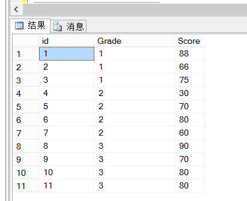
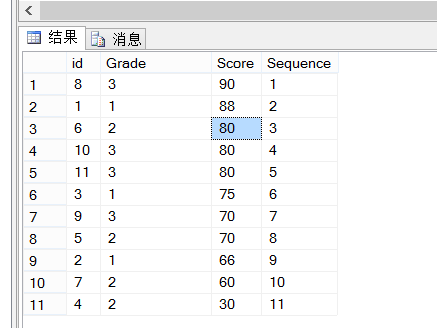
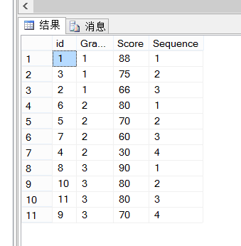
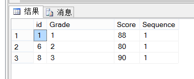
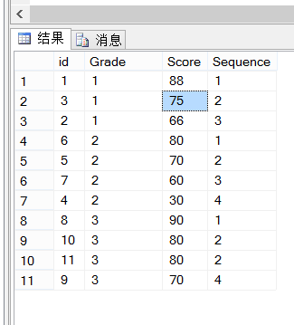
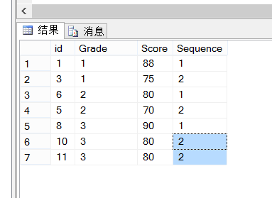

## 常用函数

### partition by

分析函数用于计算基于组的某种聚合值，它和聚合函数的不同之处是：分析函数对于==每个组返回多行==，而聚合函数对于==每个组只返回一行==。

partition by关键字是分析性函数的一部分，它和聚合函数不同的地方在于它能返回一个分组中的多条记录，而聚合函数一般只有一条反映统计值的记录，partition by用于给结果集分组，如果没有指定那么它把整个结果集作为一个分组，分区函数一般与排名函数一起使用。

测试数据

```sql
create table Student  --学生成绩表
(
 id int,  --主键
 Grade int, --班级
 Score int --分数
)
go

insert into Student values(1,1,88)
insert into Student values(2,1,66)
insert into Student values(3,1,75)
insert into Student values(4,2,30)
insert into Student values(5,2,70)
insert into Student values(6,2,80)
insert into Student values(7,2,60)
insert into Student values(8,3,90)
insert into Student values(9,3,70)
insert into Student values(10,3,80)
insert into Student values(11,3,80)
```



**一、分区函数Partition By的与`row_number()`的用法**

1、不分班按学生成绩排名

```sql
select *,row_number() over(order by Score desc) as Sequence from Student
```

执行结果：



2、分班后按学生成绩排名

```sql
select *,row_number() over(partition by Grade order by Score desc) as Sequence from Student
```

执行结果：



3、获取每个班的前1(几)名

```sql
select * from
(
select *,row_number() over(partition by Grade order by Score desc) as Sequence from Student
)T where T.Sequence<=1
```

执行结果：




**二、分区函数Partition By与排序`rank()`的用法**

**rank()和dense_rank()区别：**

- `rank()`是跳跃排序，有两个第二名时接下来就是第四名；
- `dense_rank()`l是连续排序，有两个第二名时仍然跟着第三名

1、分班后按学生成绩排名 该语句是对分数相同的记录进行了同一排名，例如：两个80分的并列第2名，第4名就没有了

```sql
select *,rank() over(partition by Grade order by Score desc) as Sequence from Student
```

执行结果：



2、获取每个班的前2(几)名 该语句是对分数相同的记录进行了同一排名，例如：两个80分的并列第2名，第4名就没有了

```sql
select * from
(
select *,rank() over(partition by Grade order by Score desc) as Sequence from Student
)T where T.Sequence<=2
```

执行结果：




### merge into

1. 按照指定的条件执行插入或更新操作
2. 如果满足条件的行存在，执行更新操作；否则执行插入操作： – 避免多次重复执行插入和删除操作 – 提高效率而且使用方便 – 在数据仓库应用中经常使用作

```sql
MERGE INTO table_name table_alias
	USING (table|view|sub_query) alias
	ON (join condition)
	WHEN MATCHED THEN
		UPDATE SET
		col1 = col_val1,
		col2 = col2_val
	WHEN NOT MATCHED THEN
		INSERT (column_list)
		VALUES (column_values);
```

- 解释：
  WHEN MATCHED THEN 存在则执行 UPDATE； WHEN NOT MATCHED THEN 不存在则执行 INSERT
- 举例： 在对表COPY_EMP 使用merge 语句，根据指定的条件从表EMPLOYEES 中插入或更新数据。

```sql
MERGE INTO copy_emp c
	USING employees e
	ON (c.employee_id = e.employee_id)
WHEN MATCHED THEN
	UPDATE SET
	c.first_name = e.first_name,
	c.last_name = e.last_name,
	...
	c.department_id = e.department_id
WHEN NOT MATCHED THEN
	INSERT VALUES(e.employee_id, e.first_name, e.last_name,
				e.email, e.phone_number, e.hire_date, e.job_id,
				e.salary, e.commission_pct, e.manager_id,
				e.department_id);
```


### with A(a) as ()

> WITH AS短语，也叫做子查询部分（subquery factoring），是用来定义一个SQL片断，该SQL片断会被整个SQL语句所用到。这个语句算是公用表表达式（CTE）。

  比如

```sql
with A as (select * from class)
select *from A  
```

这个语句的意思就是，先执行select * from class   得到一个结果，将这个结果记录为A  ，在执行select *from A  语句。A 表只是一个别名。

也就是将重复用到的大批量 的SQL语句，放到with  as 中，加一个别名，在后面用到的时候就可以直接用。

对于大批量的SQL数据，起到优化的作用。

二、with的相关总结（摘录别人博客）

1.使用with子句可以让子查询重用相同的with查询块,通过select调用（with子句只能被select查询块引用），一般在with查询用到多次情况下。在引用的select语句之前定义,同级只能定义with关键字只能使用一次,多个用逗号分割。

2.with子句的返回结果存到用户的临时表空间中，只做一次查询，反复使用,提高效率。

3.在同级select前有多个查询定义的时候，第1个用with，后面的不用with，并且用逗号隔开。


4.最后一个with 子句与下面的查询之间不能有逗号，只通过右括号分割,with 子句的查询必须用括号括起来


5.如果定义了with子句，而在查询中不使用，那么会报ora-32035 错误：未引用在with子句中定义的查询名。（至少一个with查询的name未被引用，解决方法是移除未被引用的with查询），注意：只要后面有引用的就可以，不一定非要在主查询中引用，比如后面的with查询也引用了，也是可以的。


6.前面的with子句定义的查询在后面的with子句中可以使用。但是一个with子句内部不能嵌套with子句。


7.当一个查询块名字和一个表名或其他的对象相同时，解析器从内向外搜索，优先使用子查询块名字。

8.with查询的结果列有别名，引用的时候必须使用别名或*。

### date diff

日期天数差值计算

db2: days(date1)-days(date2)

dm: datediff(datepart,date1,date2) datepart设置为DAY

mysql: 1.DATEDIFF(date1,date2)  2.TIMESTAMPDIFF(DAY,date1,date2)

### sustring

返回char中从字符位置m开始的n个字符

```sql
substr/subsring（char[,m[,n]])  /  substr/subsring(str,pos,len)
sustr/substring(char[from m[for n]])
```


### listagg

> 列值拼接函数

```sql
LISTAGG ( column | expression, delimiter ) WITHIN GROUP (ORDER BY column | expression) OVER (PARTITION BY column | expression)
-- eg 根据年纪排序后列转行
SELECT listagg(name, ','),age WITHIN GROUP (ORDER BY age ) from t_pub_company
```

### locate

> 返回字符串`char1`在`char2`中从位置`n`开始首次出现的位置，如果参数`n`省略或为负数，则从`char2`的最左边开始查找

```
locate(char1,char2[,n])
```

### coalesce

> 返回参数中第一个非空的值，如果所有参数均为null，则返回null

```
coalesce(n1,n2,...,nx)
```

### concat

> 返回多个字符串顺序联结成一个字符串，等价于`||`

```
concat(char1,char2,...)
```

### repeat

> 返回将字符串重复n次形成的字符串

```sql
repeat/repeatstr(char,n)
```

eg

```sql
select repeat('hello ',3);
--结果hello hello hello 
```


### NVL**(expr1,expr2)** 

> 如果表达式1为空值，NVL返回值为表达式2的值，否则返回表达式1的值。

mysql使用类似函数`IFNULL(expr1,expr2) `

### cast(value as type)

> 将参数value转换为type类型返回

### decode

> 将输入数值与函数中的参数列表相比较，根据输入值返回一个对应值

```
DECODE(control_value,value1,result1[,value2,result2…][,default_result]);
   control _value
-- 试图处理的数值。DECODE函数将该数值与后面的一系列的偶序相比较，以决定返回值。
　　value1 ：
-- 是一组成序偶的数值。如果输入数值与之匹配成功，则相应的结果将被返回。对应一个空的返回值，可以使用关键字NULL于之对应
　　result1：
-- 是一组成序偶的结果值。
```

```sql
DECODE(exp, search1, result1, … searchn, resultn[,default])
--功能：查表译码，DECODE 函数将 exp 与 search1,search2, … searchn 相比较，
--如果等于 searchx，则返回 resultx，如果没有找到匹配项，则返回 default, 如果未
--定义 default，返回 NULL。

```


> eg

```
select decode( x , 1 , ‘x is 1 ’, 2 , ‘x is 2 ’, ‘others’) from dual
```

- 当x等于1时，则返回‘x is 1’。
- 当x等于2时，则返回‘x is 2’。
- 否则，返回others’。


## sql

### group by
select指定的字段要么就要包含在group By语句的后面，作为分组的依据；要么就要被包含在聚合函数（ sum，max，min ，count）中。

> group by 字句和where 字句一起使用

- 在SQL中where字句的运行顺序是先于 group by字句的，where字句会会在形成组和计算列函数之前消除不符合条件的行
> group by 字句和having() 字句一起使用

- 在SQL 中 having() 字句的运行顺序是后于 group by字句的， having() 字句的的作用是筛选满足条件的组

> Having与Where的区别
- where 子句的作用是在***对查询结果进行分组前***，将不符合where条件的行去掉，即在分组之前过滤数据，***where条件中不能包含聚组函数***，使用where条件过滤出特定的行。
- having 子句的作用是筛选满足条件的组，即***在分组之后过滤数据，条件中经常包含聚组函数***，使用having 条件***过滤出特定的组***，也可以使用多个分组标准进行分组。


### in和exist
```sql
select * from A where id in (select id from B);
select * from A where exists (select 1 from B where A.id=B.id);
```
>in是在内存里遍历比较，而exists需要查询数据库

#### 1. IN()语句内部工作原理

> IN()只执行一次，它查出B表中的所有id字段并缓存起来。之后，检查A表的id是否与B表中的id相等，如果相等则将A表的记录加入结果集中，直到遍历完A表的所有记录。

可以看出，当B表数据较大时不适合使用in()，因为它会B表数据全部遍历一次

- 例1：A表有10000条记录，B表有1000000条记录，那么最多有可能遍历`10000*1000000`次，效率很差。
- 例2：A表有10000条记录，B表有100条记录，那么最多有可能遍历`10000*100`次，遍历次数大大减少，效率大大提升。


#### 2、EXISTS()语句内部工作原理
> exists()会执行A.length次，它并不缓存exists()结果集，因为exists()结果集的内容并不重要，重要的是其内查询语句的结果集空或者非空，空则返回false，非空则返回true。

当B表比A表数据大时适合使用exists()，因为它没有那么多遍历操作，只需要再执行一次查询就行。

- 例1：A表有10000条记录，B表有1000000条记录，那么exists()会执行10000次去判断A表中的id是否与B表中的id相等。
- 例2：A表有10000条记录，B表有100000000条记录，那么exists()还是执行10000次，因为它只执行A.length次，可见B表数据越多，越适合exists()发挥效果。
- 例3：A表有10000条记录，B表有100条记录，那么exists()还是执行10000次，还不如使用in()遍历10000*100次，因为in()是在内存里遍历比较，而exists()需要查询数据库，我们都知道查询数据库所消耗的性能更高，而内存比较很快。

【注】
> EXISTS用于检查子查询是否至少会返回一行数据，该子查询实际上并不返回任何数据，而是返回值True或False。

> 分析器会先看语句的第一个词，当它发现第一个词是SELECT关键字的时候，它会跳到FROM关键字，然后通过FROM关键字找到表名并把表装入内存。接着是找WHERE关键字，如果找不到则返回到SELECT找字段解析，如果找到WHERE，则分析其中的条件，完成后再回到SELECT分析字段。最后形成一张我们要的虚表。

> WHERE关键字后面的是条件表达式。条件表达式计算完成后，会有一个返回值，即非0或0，非0即为真(true)，0即为假(false)。同理WHERE后面的条件也有一个返回值，真或假，来确定接下来执不执行SELECT。

#### 使用情况分析
> in 是把外表和内表作hash 连接，而exists是对外表作loop循环，每次loop循环再对内表进行查询。
EXISTS与IN的使用效率的问题，通常情况下采用exists要比in效率高，因为IN不走索引。但要看实际情况具体使用：
- IN适合于外表大而内表小的情况；
- EXISTS适合于外表小而内表大的情况。


## 事务

在执行SQL语句的时候，某些业务要求，一系列操作必须全部执行，而不能仅执行一部分。例如，一个转账操作：
```sql
-- 从id=1的账户给id=2的账户转账100元
-- 第一步：将id=1的A账户余额减去100
UPDATE accounts SET balance = balance - 100 WHERE id = 1;
-- 第二步：将id=2的B账户余额加上100
UPDATE accounts SET balance = balance + 100 WHERE id = 2;
```
这两条SQL语句必须全部执行，或者，由于某些原因，如果第一条语句成功，第二条语句失败，就必须全部撤销。

这种把多条语句作为一个整体进行操作的功能，被称为**数据库事务**。数据库事务可以确保该事务范围内的所有操作都可以全部成功或者全部失败。如果事务失败，那么效果就和没有执行这些SQL一样，不会对数据库数据有任何改动。

### ACID特性
- A：Atomic，原子性，将所有SQL作为原子工作单元执行，要么全部执行，要么全部不执行；
- C：Consistent，一致性，事务完成后，所有数据的状态都是一致的，即A账户只要减去了100，B账户则必定加上了100；
- I：Isolation，隔离性，如果有多个事务并发执行，每个事务作出的修改必须与其他事务隔离；
- D：Duration，持久性，即事务完成后，对数据库数据的修改被持久化存储。

### 隐式事务与显式事务
对于单条SQL语句，数据库系统自动将其作为一个事务执行，这种事务被称为**隐式事务**。

要手动把多条SQL语句作为一个事务执行，使用`BEGIN`开启一个事务，使用`COMMIT`提交一个事务，这种事务被称为显式事务，例如，把上述的转账操作作为一个**显式事务**：
```sql
BEGIN;
UPDATE accounts SET balance = balance - 100 WHERE id = 1;
UPDATE accounts SET balance = balance + 100 WHERE id = 2;
COMMIT;
```
很显然多条SQL语句要想作为一个事务执行，就必须使用显式事务。

`COMMIT`是指提交事务，即试图把事务内的所有SQL所做的修改永久保存。如果`COMMIT`语句执行失败了，整个事务也会失败。

### 回滚
> 有些时候，我们希望主动让事务失败，这时，可以用`ROLLBACK`回滚事务，整个事务会失败：
```sql
BEGIN;
UPDATE accounts SET balance = balance - 100 WHERE id = 1;
UPDATE accounts SET balance = balance + 100 WHERE id = 2;
ROLLBACK;
```
数据库事务是由数据库系统保证的，我们只需要根据业务逻辑使用它就可以。

### 隔离级别
> 对于两个并发执行的事务，如果涉及到操作同一条记录的时候，可能会发生问题。因为并发操作会带来数据的不一致性，包括脏读、不可重复读、幻读等。数据库系统提供了隔离级别来让我们有针对性地选择事务的隔离级别，避免数据不一致的问题。

SQL标准定义了4种隔离级别，分别对应可能出现的数据不一致的情况：


| Isolation Level  | 脏读（Dirty Read） | 不可重复读（Non Repeatable Read） | 幻读（Phantom Read） |
| :--------------- | :----------------- | :-------------------------------- | :------------------- |
| Read Uncommitted | Yes                | Yes                               | Yes                  |
| Read Committed   | -                  | Yes                               | Yes                  |
| Repeatable Read  | -                  | -                                 | Yes                  |
| Serializable     | -                  | -                                 | -                    |

#### Read Uncommitted
> Read Uncommitted是隔离级别最低的一种事务级别。在这种隔离级别下，一个事务会读到另一个事务更新后但未提交的数据，如果另一个事务回滚，那么当前事务读到的数据就是脏数据，这就是脏读（Dirty Read）。

eg
```sql
mysql> select * from students;
+----+-------+
| id | name  |
+----+-------+
|  1 | Alice |
+----+-------+
1 row in set (0.00 sec)
```

分别开启两个MySQL客户端连接，按顺序依次执行事务A和事务B：

| 时刻 | 事务A                                             | 事务B                                             |
| :--- | :------------------------------------------------ | :------------------------------------------------ |
| 1    | SET TRANSACTION ISOLATION LEVEL READ UNCOMMITTED; | SET TRANSACTION ISOLATION LEVEL READ UNCOMMITTED; |
| 2    | BEGIN;                                            | BEGIN;                                            |
| 3    | UPDATE students SET name = 'Bob' WHERE id = 1;    |                                                   |
| 4    |                                                   | SELECT * FROM students WHERE id = 1;              |
| 5    | ROLLBACK;                                         |                                                   |
| 6    |                                                   | SELECT * FROM students WHERE id = 1;              |
| 7    |                                                   | COMMIT;                                           |

当事务A执行完第3步时，它更新了id=1的记录，但并未提交，而事务B在第4步读取到的数据就是未提交的数据。

随后，事务A在第5步进行了回滚，事务B再次读取id=1的记录，发现和上一次读取到的数据不一致，这就是脏读。

可见，在Read Uncommitted隔离级别下，一个事务可能读取到另一个事务更新但未提交的数据，这个数据有可能是脏数据。

#### Read Committed
> 在Read Committed隔离级别下，一个事务可能会遇到不可重复读（Non Repeatable Read）的问题。

> 不可重复读是指，在一个事务内，多次读同一数据，在这个事务还没有结束时，如果另一个事务恰好修改了这个数据，那么，在第一个事务中，两次读取的数据就可能不一致。

```sql
mysql> select * from students;
+----+-------+
| id | name  |
+----+-------+
|  1 | Alice |
+----+-------+
1 row in set (0.00 sec)
```

然后，分别开启两个MySQL客户端连接，按顺序依次执行事务A和事务B：

| 时刻 | 事务A                                           | 事务B                                           |
| :--- | :---------------------------------------------- | :---------------------------------------------- |
| 1    | SET TRANSACTION ISOLATION LEVEL READ COMMITTED; | SET TRANSACTION ISOLATION LEVEL READ COMMITTED; |
| 2    | BEGIN;                                          | BEGIN;                                          |
| 3    |                                                 | SELECT * FROM students WHERE id = 1;            |
| 4    | UPDATE students SET name = 'Bob' WHERE id = 1;  |                                                 |
| 5    | COMMIT;                                         |                                                 |
| 6    |                                                 | SELECT * FROM students WHERE id = 1;            |
| 7    |                                                 | COMMIT;                                         |

当事务B第一次执行第3步的查询时，得到的结果是`Alice`，

随后，由于事务A在第4步更新了这条记录并提交，

所以，事务B在第6步再次执行同样的查询时，得到的结果就变成了`Bob`，

因此，在Read Committed隔离级别下，事务不可重复读同一条记录，因为很可能读到的结果不一致。


#### Repeatable Read
> 在Repeatable Read隔离级别下，一个事务可能会遇到幻读（Phantom Read）的问题。

> 幻读是指，在一个事务中，第一次查询某条记录，发现没有，但是，当试图更新这条不存在的记录时，竟然能成功，并且，再次读取同一条记录，它就神奇地出现了。

```
mysql> select * from students;
+----+-------+
| id | name  |
+----+-------+
|  1 | Alice |
+----+-------+
1 row in set (0.00 sec)
```

然后，分别开启两个MySQL客户端连接，按顺序依次执行事务A和事务B：

| 时刻 | 事务A                                               | 事务B                                             |
| :--- | :-------------------------------------------------- | :------------------------------------------------ |
| 1    | SET TRANSACTION ISOLATION LEVEL REPEATABLE READ;    | SET TRANSACTION ISOLATION LEVEL REPEATABLE READ;  |
| 2    | BEGIN;                                              | BEGIN;                                            |
| 3    |                                                     | SELECT * FROM students WHERE id = 99;             |
| 4    | INSERT INTO students (id, name) VALUES (99, 'Bob'); |                                                   |
| 5    | COMMIT;                                             |                                                   |
| 6    |                                                     | SELECT * FROM students WHERE id = 99;             |
| 7    |                                                     | UPDATE students SET name = 'Alice' WHERE id = 99; |
| 8    |                                                     | SELECT * FROM students WHERE id = 99;             |
| 9    |                                                     | COMMIT;                                           |

事务B在第3步第一次读取`id=99`的记录时，读到的记录为空，说明不存在`id=99`的记录。

随后，事务A在第4步插入了一条`id=99`的记录并提交。

事务B在第6步再次读取`id=99`的记录时，读到的记录仍然为空，但是，事务B在第7步试图更新这条不存在的记录时，竟然成功了，并且，事务B在第8步再次读取`id=99`的记录时，记录出现了。

可见，幻读就是没有读到的记录，以为不存在，但其实是可以更新成功的，并且，更新成功后，再次读取，就出现了。

#### Serializable


