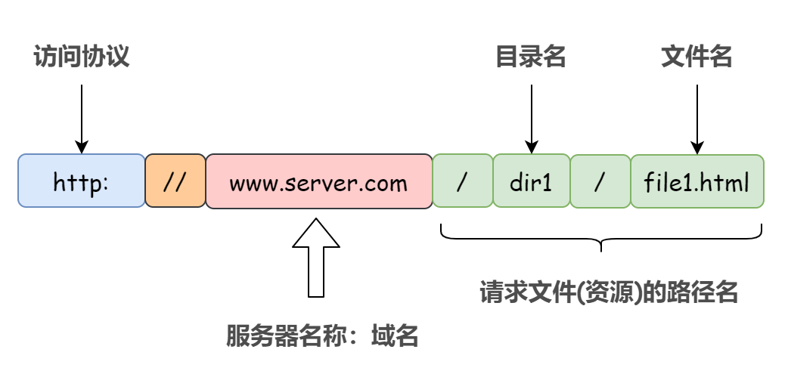
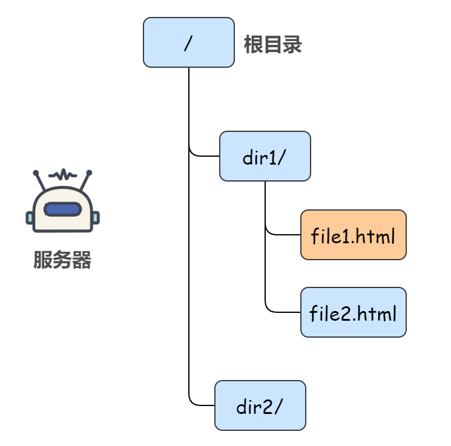
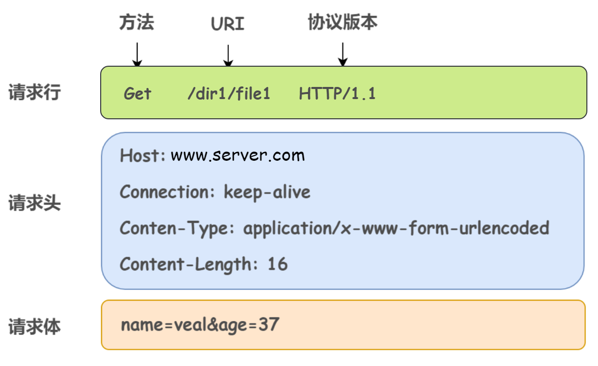
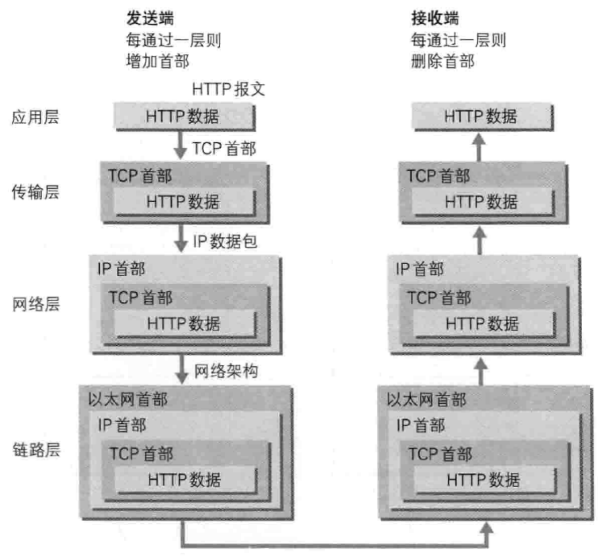
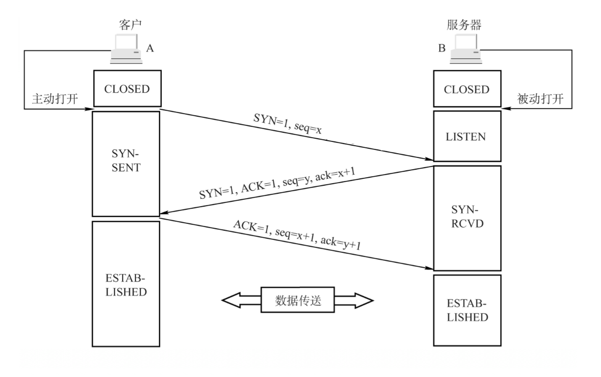
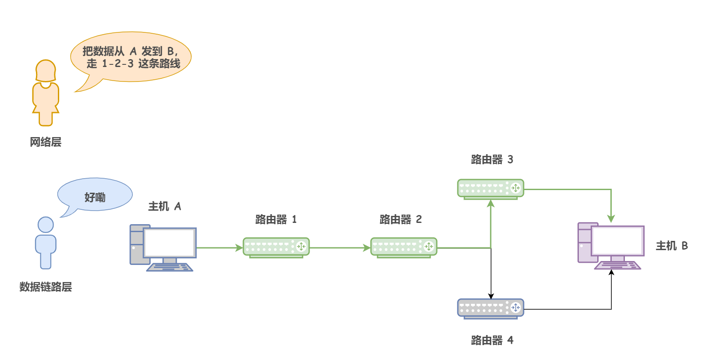
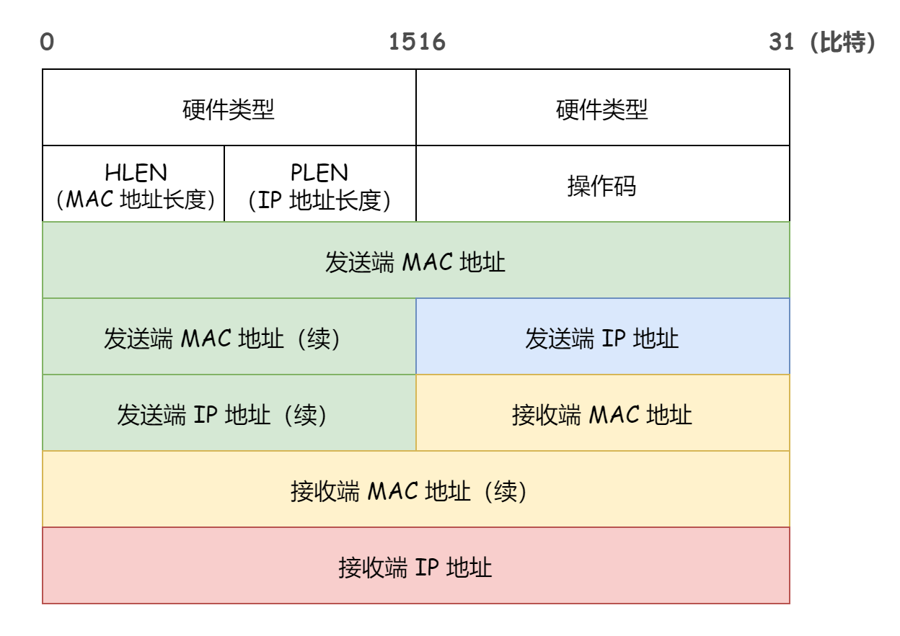
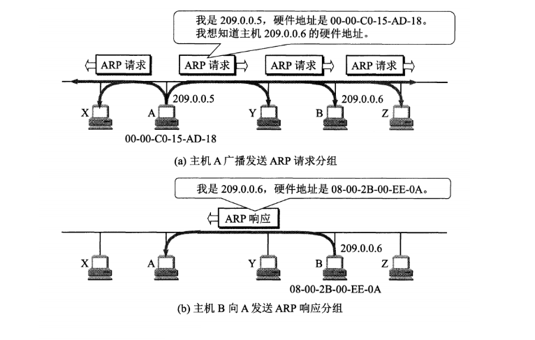
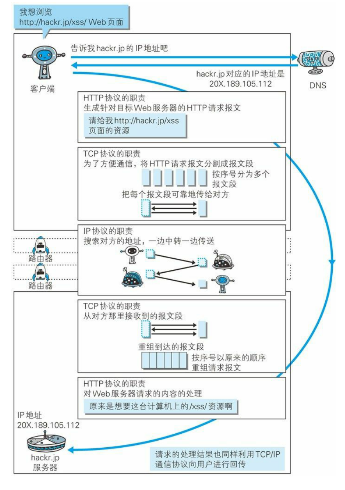

# 浏览器输入URL后回车

> 在浏览中输入 URL 并且获取响应的过程，其实就是浏览器和该 URL 对应的服务器的网络通信过程。比如我们输入 `www.baidu.com`，那么会返回一个百度搜索的界面，这其实就是浏览器和百度服务器之间的网络通信过程。浏览器就是客户端，用于发出请求，而百度的服务器就是服务端，用于接收并响应请求。

## 1. 解析 URL

URL 各元素的组成如下（当然，下述请求文件的路径名可以省略）：

这个 URL 请求的目标服务器上的文件路径就是：

那么首先，浏览器做的第一步就是解析 URL 得到里面的参数，将域名和需要请求的资源分离开来，从而了解需要请求的是哪个服务器，请求的是服务器上什么资源等等。

## 2. 浏览器封装 HTTP 请求报文

对 `URL` 进行解析之后，浏览器确定了目标服务器和文件名，接下来就需要根据这些消息**封装**成一个 HTTP 请求报文发送出去。举个 HTTP 请求报文的例子：

> 关于 HTTP 协议详细可见 [HTTP 协议的前世今生](https://mp.weixin.qq.com/s/98FtlAy0mAtf6tGplQMDqA) 

解释一下**封装**，这是一个贯穿整个计算机网络的概念。就是说发送端在层与层之间传输数据时，每经过一层必定会被打上一个该层所属的首部信息。反之，接收端在层与层之间传输数据时，每经过一层就会把该层对应的首部信息消去。

## 3. DNS 域名解析获取 IP 地址

> 虽然解析得到了域名，理论浏览器已经知道目标服务器是谁了。但是实际上，域名并不是目标服务器真正意义上的地址，互联网上每一台计算机都被全世界唯一 IP 地址标识着，但是 IP 地址并不方便记忆，所以才设计出了域名。

1）首先搜索**浏览器的 DNS 缓存**，缓存中维护着一张域名与 IP 地址的对应表；

2）若没有命中，则继续搜索**操作系统的 DNS 缓存**；

3）若仍然没有命中，则操作系统将域名发送至**本地域名服务器**，本地域名服务器查询自己的 DNS 缓存，查找成功则返回结果（注意：主机和本地域名服务器之间的查询方式是**递归查询**）；

4）若本地域名服务器的 DNS 缓存没有命中，则本地域名服务器向**上级域名服务器**进行查询，通过以下方式进行**迭代查询**（注意：本地域名服务器和其他域名服务器之间的查询方式是迭代查询，防止根域名服务器压力过大）：

- 首先本地域名服务器向**根域名服务器**发起请求，根域名服务器是最高层次的，它并不会直接指明这个域名对应的 IP 地址，而是返回顶级域名服务器的地址，也就是说给本地域名服务器指明一条道路，让他去这里寻找答案
- 本地域名服务器拿到这个**顶级域名服务器**的地址后，就向其发起请求，获取**权限域名服务器**的地址
- 本地域名服务器根据**权限域名服务器**的地址向其发起请求，最终得到该域名对应的 IP 地址

4）本地域名服务器将得到的 IP 地址返回给操作系统，同时自己将 IP 地址缓存起来

5）操作系统将 IP 地址返回给浏览器，同时自己也将 IP 地址缓存起来

6）至此，浏览器就得到了域名对应的 IP 地址，并将 IP 地址缓存起来

配合下图直观理解：

需要注意的是，`DNS` 使用的是 `UDP` 协议，也就是说上面各种请求的转发，都是基于` UDP` 这个无连接协议的。

## 4. 建立 TCP 连接

获取到了目标服务器的 IP 地址之后，浏览器就知道我等下请求要发给谁了，这个时候就可以开始发送封装好了的 HTTP 请求报文了，那么既然需要发送请求，必然就需要 TCP 通过三次握手为浏览器和服务器之间建立可靠的连接，**保证双方都具有可靠的接收和发送能力**。

> 这里又是一道经典的面试题：TCP 三次握手和四次挥手，详细可见 [关于 TCP 三次握手和四次挥手，满分回答在此](https://mp.weixin.qq.com/s/u56NcMs68sgi6uDpzJ61yw) 这篇文章。

三次握手过程如下图：

## 5. 浏览器发送请求

TCP 三次握手完成后，浏览器与目标服务器之间就建立了一个可靠的虚拟通道，于是浏览器就可以发送自己的 HTTP 请求了。

需要注意的是，HTTP 请求报文或者响应报文在 TCP 连接通道上进行传输的时候，由于这些报文比较大，为了更容易和准确可靠的传输，**TCP 会将 HTTP 报文按序号分割成若干报文段并加上 TCP 首部，分别进行传输。接收方在收到这些报文段后，按照序号以原来的顺序重组 HTTP 报文**。

## 6. 负责传输的 IP 协议

实际上，TCP 在三次握手建立连接、四次握手断开连接、以及连接建立过程中的收发数据（TCP 报文段）等各阶段操作时，都是通过 IP 协议进行传输的，IP 协议将这些阶段的数据添加 IP 首部封装成 IP 数据报再进行传输。

IP 数据报的首部存有**源 IP 地址**和 **目标 IP 地址**。所谓源 IP 地址 就是发送方的 IP 地址；目标 IP 地址就是通过 DNS 域名解析得到的目标服务器的 IP 地址。

事实上，**IP 协议身处的网络层规定的是：数据报要通过怎样的路径（传输路线）才能到达对方计算机，并传送给对方**。

## 7. 使用 ARP 协议凭借 MAC 地址通信

> 关于 IP 协议、IP 地址、MAC 地址等详细请看 [别再恐惧 IP 协议（万字长文 | 多图预警）](https://mp.weixin.qq.com/s/NO9RDt1A3T1rz-Q4_Y0gPw) 这篇文章。

上面说了，IP 协议的作用是把各种数据包传送给对方，而要保证确实传送到对方那里，则需要满足各类条件，其中必要的两个就是 IP 地址 和 MAC 地址。

看下面这幅图，在网络上，**通信的双方在同一局域网内的情况是很少见的，通常是需要多台计算机和网络设备的中转才能连接到对方。而在进行中转时，就需要利用下一站中转设备的 MAC 地址来搜索下一个中转目标**。

- 网络层指定了从哪个主机（「源 IP 地址」）发送到哪个主机（「目的 IP 地址」）。**源 IP 地址和目标 IP 地址在传输过程中是不会变化的**

- 而数据链路层则是根据 MAC 地址在一个接一个的区间中进行传输的，每个区间内的出发地址即「源 MAC 地址」，每个区间内的目的地址即「目的 MAC 地址」。显然，随着数据的传输，**源 MAC 地址和目的 MAC 地址会不断的发生变化**

  比如上图，**网络层告知了 1-2-3 路线，也就是说指明了这几个路由器的 IP 地址。那么数据链路层就会根据这几个 IP 地址对应的 MAC 地址依次找到 1、2、3，并在他们之间传输数据**。

> **将 IP 地址转化为 MAC 地址**，从而在数据链路层精确的传输数据的协议就是 **ARP 协议**。

ARP 是借助 **ARP 请求与 ARP 响应**两种类型的包确定 MAC 地址的。并且每个主机都有一个 **ARP 高速缓存**，里面有本局域网上的各主机和路由器的 **IP 地址到 MAC 地址的映射表**。

1）首先，主机 A 为了获得主机 B 的 MAC 地址，它会先去查询自己的 ARP 高速缓存中有没有主机 B 的相关记录；

2）如果主机 A 的 ARP 高速缓存中没有主机 B 的 IP 地址到 MAC 地址的映射，主机 A 就会通过**广播**的方式发送 **ARP 请求包**（该包携带自己的 IP 地址 和 MAC 地址 以及 目标主机的 IP 地址），表明自己想要获得主机 B 的 MAC 地址；

3） 由于广播请求可以被同一个链路上的所有主机或路由器接收，因此如果这条链路上某个主机或路由的 IP 地址与这个 ARP 请求包中包含的目标主机的 IP 地址相同，那么这个节点就将自己的 MAC 地址塞入 **ARP 响应包**中返回给主机 A；

> 当然，ARP 响应包是以单播的形式进行发送的，毕竟 ARP 请求包中已经包含了主机 A 的 IP 地址，所以主机 B 非常清楚这个响应包应该发送给谁。
>
> 大部分网络协议在设计的时候，都是保持极度克制的，不需要的交互就砍掉，能合并的信息就合并，能不用广播就用单播，以此让带宽变得更多让网络变得更快。

4）主机 A 在收到主机 B 发过来的 ARP 响应包后，向其 ARP 高速缓存中写入主机 B 的 IP 地址到 MAC 地址的映射。

当然，缓存是有一定期限的，超过这个期限，缓存的内容将被清空。这也使得即使 MAC 地址和 IP 地址的映射关系发生了变化，也依然能够正确的将数据包发送给目标地址。

## 8. 服务器响应请求

浏览器的 HTTP 请求报文通过 TCP 三次握手建立的连接通道被切分成若干报文段分别发送给服务器，服务器在收到这些报文段后，按照序号以原来的顺序重组 HTTP 请求报文。然后处理并返回一个 HTTP 响应。当然，HTTP 响应报文也要经过和 HTTP 请求报文一样的过程。

## 9. 断开 TCP 连接

浏览器和服务器都不再需要发送数据后，四次挥手断开 TCP 连接，详细可见 [关于 TCP 三次握手和四次挥手，满分回答在此](https://mp.weixin.qq.com/s/u56NcMs68sgi6uDpzJ61yw) 这篇文章。

## 10. 浏览器显示界面

浏览器接收到服务器返回的数据包，根据浏览器的渲染机制对相应的数据进行渲染

## 总结

屏蔽掉底层细节，笼统的总结一下上述过程：

应用层：

- 浏览器封装 HTTP 请求报文
- DNS 解析域名获得目标服务器地址

传输层：

- 建立连接
- 把应用层传过来的 HTTP 请求报文进行分割，并在各个报文上打上标记序号及端口号转发给网络层

网络层：

- 利用 ARP 协议根据 IP 地址获取作为通信目的地的 MAC 地址后转发给链路层

服务端在链路层收到数据，按序往上层发送，一直到应用层接收到浏览器发送来的 HTTP 请求报文，然后处理该请求并返回 HTTP 响应报文，浏览器接收到响应报文之后解析渲染界面。最后 TCP 断开连接。

